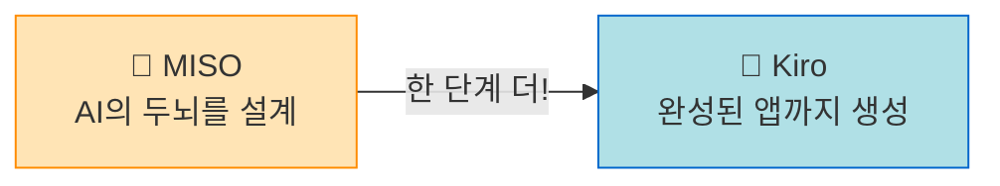
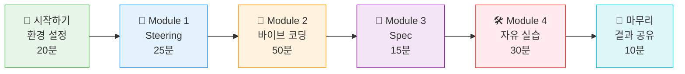

# 🎉 Kiro Workshop - GS25 편의점 AI 도우미 만들기

## 💬 "말로 만드는 우리 점포 AI 도우미"

코드를 한 줄도 모르셔도 **전혀** 괜찮습니다! 👌\
오늘 여러분은 **대화만으로** 편의점 업무에 도움이 되는 AI 웹앱을 직접 만들어봅니다.

마치 카카오톡으로 대화하듯, AI에게 말만 하면 앱이 뚝딱 만들어지는 경험을 해보세요! ✨

---

## 🤗 걱정하지 마세요!

혹시 이런 걱정을 하고 계신가요?

| 걱정 😰 | 현실 😊 |
| --- | --- |
| "코딩을 전혀 모르는데..." | 코드를 직접 쓸 일이 **전혀 없습니다!** AI가 다 해줘요 |
| "컴퓨터를 잘 못하는데..." | 카카오톡 칠 수 있으면 충분합니다 💬 |
| "MISO도 겨우 했는데..." | MISO 하셨으면 오늘 건 **더 쉽습니다!** |
| "영어가 나오면 어쩌지..." | 모든 것을 **한국어**로 진행합니다 🇰🇷 |
| "실수하면 어떡하지..." | 실수해도 AI에게 "다시 해줘"라고 하면 됩니다! 🔄 |

> **💪 자신감을 가지세요!**\
> 코딩 경험이 없으셔도 **모두 멋진 앱을 완성**하고 가실 수 있습니다!

---

## 🎯 오늘 만들 것

편의점 운영 중 겪는 불편함을 해결하는 **나만의 AI 도우미 웹앱**을 만듭니다.

| 예시 앱 | 이런 걸 해결해요 |
| --- | --- |
| 📚 **규정 검색 도우미** | 470페이지 매뉴얼을 뒤지는 대신, 질문 한 마디로 답을 찾는 앱 |
| 📝 **사고 대응 보고서 생성기** | 상황만 입력하면 보고서 초안이 자동으로 나오는 앱 |
| 🏪 **담배권 리스크 체크** | 점포 주소만 넣으면 리스크 등급을 알려주는 앱 |

---

## 🔧 Kiro가 뭔가요?

**Kiro**는 Amazon이 만든 **AI 코딩 도구**입니다.

쉽게 말하면 이렇습니다:

> 여러분이 **"이런 앱 만들어줘"** 라고 한국어로 말하면,\
> Kiro가 **알아서 코드를 짜서** 진짜 작동하는 앱을 만들어줍니다! 🪄

### 🔄 MISO에서 해보셨던 것과 비교

여러분이 이미 MISO에서 드래그앤드롭으로 에이전트 워크플로우를 만들어보셨죠?\
Kiro는 거기서 한 발 더 나아갑니다!

| | 🧩 MISO (해보셨던 것) | 🚀 Kiro (오늘 할 것) |
| --- | --- | --- |
| **만드는 방법** | 블록을 드래그해서 연결 | 한국어로 대화 |
| **만들 수 있는 것** | AI 에이전트의 **두뇌** (작동 방식) | 사람이 쓸 수 있는 **완성된 앱** (화면 + 기능) |
| **결과물** | 워크플로우 (개발자가 추가 작업 필요) | 바로 쓸 수 있는 웹앱 |

> **ℹ️ 참고**\
> MISO로 만든 것 = 요리 레시피 📋\
> Kiro로 만든 것 = 완성된 요리 + 예쁜 접시까지! 🍽️

---

## 📋 워크샵 전체 흐름

오늘 워크샵은 이렇게 진행됩니다:

| Module | 내용 | 시간 | 난이도 |
| --- | --- | --- | --- |
| **🏁 시작하기** | 워크샵 소개 + 환경 설정 | 20분 | ⭐ |
| **📏 Module 1** | Steering - AI에게 규칙 알려주기 | 25분 | ⭐ |
| **💬 Module 2** | 바이브 코딩 - 말로 앱 만들기 | 50분 | ⭐⭐ |
| **📐 Module 3** | Spec - 요구사항 정리하기 | 15분 | ⭐ |
| **🛠️ Module 4** | 자유 실습 - 우리 점포 도우미 만들기 | 30분 | ⭐⭐ |
| **🎉 마무리** | 결과 공유 + 정리 | 10분 | - |

> **⏰ 총 소요 시간: 약 2시간 30분**

---

## 🎒 사전 준비물

| 준비물 | 체크 |
| --- | --- |
| 💻 노트북 (Windows 또는 Mac) | ⬜ |
| 🌐 인터넷 연결 (Wi-Fi) | ⬜ |
| 😊 열린 마음과 호기심! | ⬜ |

---

그럼 시작해볼까요? 👉 **다음 페이지**에서 워크샵 소개를 확인하세요! 🚀
