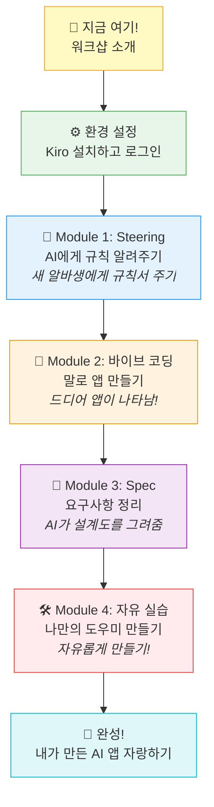
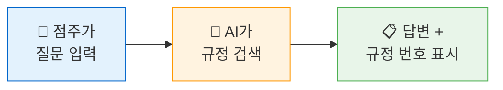

# 🎬 워크샵 소개

## 💡 왜 이 워크샵을 하나요?

여러분은 이미 **MISO**를 통해 AI 에이전트 워크플로우를 만들어본 경험이 있습니다! 👏\
드래그앤드롭으로 노드를 연결하고, 프롬프트를 작성해서 AI가 일하게 만들어보셨죠.

그런데 한 가지 아쉬운 점이 있었을 겁니다... 🤔

> **💭 "만든 워크플로우를 점주나 OFC가 바로 쓸 수 있는 앱으로 만들 수는 없을까?"**

MISO에서 만든 건 "AI의 두뇌"였습니다.\
하지만 실제로 점포에서 쓰려면 **눈에 보이는 화면**(앱)이 필요하죠!

바로 그걸 해결하는 게 오늘 배울 **Kiro**입니다! 🎯

---

## 🗺️ 오늘의 여정

오늘 우리가 걸어갈 길을 한눈에 보여드릴게요:

---

## 🎯 오늘의 목표

> **✅ 완료 조건**\
> **코드를 한 줄도 직접 작성하지 않고**, 대화만으로 편의점 업무 도우미 웹앱을 완성합니다!

구체적으로 이런 것들을 체험합니다:

| 🔢 | 체험 항목 | 쉽게 말하면 | 편의점 비유 |
| --- | --- | --- | --- |
| 1️⃣ | **Steering** | AI에게 규칙 알려주기 | 새 알바생에게 운영 규칙서 주기 📋 |
| 2️⃣ | **바이브 코딩** | 말로 앱 만들기 | "이런 메뉴판 만들어줘" 하면 뚝딱 🪄 |
| 3️⃣ | **Spec** | 요구사항 정리하면 AI가 설계 | 인테리어 업체에 "이렇게 해주세요" 하기 📐 |
| 4️⃣ | **@파일 컨텍스트** | 내 데이터를 AI에 연결 | 우리 점포 매뉴얼을 AI에게 건네주기 📁 |

---

## 👥 워크샵 진행 방식

### 2인 1조로 진행합니다! 🤝

| 역할 | 하는 일 |
| --- | --- |
| 🎮 **운전자** (Driver) | Kiro에 프롬프트를 직접 입력합니다 |
| 🧭 **안내자** (Navigator) | 결과를 확인하고, 아이디어를 제안합니다 |

> **🔄 중요!**\
> 역할을 **번갈아가며** 진행해주세요! 둘 다 직접 해봐야 재미있어요!

### 진행 규칙

- 🇰🇷 모든 작업은 **한국어**로 진행합니다
- 🙋 막히면 **언제든** 손을 들어주세요 - 진행자가 바로 도와드립니다!
- ❌ 정답이 없습니다 - 자유롭게 시도해보세요!
- 😊 틀려도 괜찮습니다 - AI에게 "다시 해줘"라고 하면 됩니다!

---

## 👀 오늘 만들 앱 미리보기

잠깐! 먼저 완성된 모습을 보여드릴게요.\
워크샵 진행자가 **완성된 데모 앱**을 직접 시연합니다! 🎬

### 이런 앱을 만들 거예요:

| 기능 | 설명 |
| --- | --- |
| 💬 **채팅형 웹 페이지** | 질문을 입력하면 규정을 찾아 답변해줍니다 |
| 🎨 **GS25 브랜드 디자인** | GS25 파란색이 적용된 깔끔한 디자인 |
| 📱 **모바일 지원** | 핸드폰에서도 잘 보이는 화면 |

### 앱이 이렇게 동작합니다:

예를 들어:
- 👤 **점주**: "유통기한 지난 도시락은 어떻게 처리해?"
- 🤖 **AI**: "유통기한 경과 상품은 즉시 진열대에서 제거하고, 폐기 처리합니다. (규정 제3-2-1조) 추가 질문이 있으시면 말씀해주세요!"

> **😮 "저게 정말 코드 없이 만들어지나요?"**\
> 네, 됩니다! 정말입니다! 오늘 직접 만들어보시면 깜짝 놀라실 거예요! 🎉\
> 자, 그럼 시작해볼까요?

---

👉 다음은 **환경 설정** 단계입니다. Kiro를 설치하고 준비해봅시다! 🛠️
