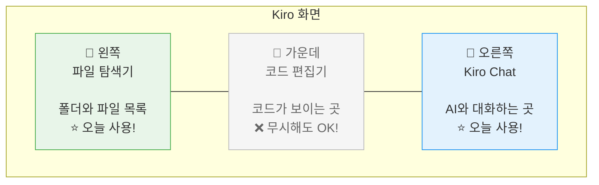

# ⚙️ 환경 설정

여기가 가장 중요한 단계입니다! 🔑\
차근차근 따라하시면 누구나 할 수 있어요. 천천히 가겠습니다!

---

## 📍 Step 1: Kiro 설치하기

### 1-1. 다운로드 링크 받기

> **ℹ️ 참고**\
> Kiro 다운로드 링크는 워크샵 당일 진행자가 화면에 띄워드립니다.\
> 진행자의 안내를 기다려주세요! ⏳

### 1-2. 다운로드하기

진행자가 알려준 링크를 **크롬(Chrome) 브라우저**에 입력합니다.

1. 화면에서 **Download** 버튼을 찾습니다 (파란색 큰 버튼입니다)
2. 본인 컴퓨터에 맞는 버전을 선택합니다:
   - **Windows** 사용자 → `Windows` 클릭
   - **Mac** 사용자 → `macOS` 클릭

> **⚠️ 잠깐!**\
> Mac 사용자 중 "Apple Silicon" 또는 "Intel" 을 선택하는 화면이 나올 수 있어요.\
> 잘 모르시겠으면 **진행자에게 물어보세요!** 전혀 부끄러운 질문이 아닙니다 😊

### 1-3. 설치하기

**Windows의 경우:**
1. 다운로드된 파일(`.exe`)을 **더블클릭**합니다
2. "이 앱이 디바이스를 변경할 수 있도록 허용하시겠어요?" → **예** 클릭
3. 설치 화면이 나오면 **Next** → **Next** → **Install** 순서로 클릭합니다
4. 설치가 끝나면 **Finish** 클릭

**Mac의 경우:**
1. 다운로드된 파일(`.dmg`)을 **더블클릭**합니다
2. 열린 창에서 **Kiro 아이콘을 Applications 폴더로 드래그**합니다
3. Applications 폴더에서 Kiro를 찾아 **더블클릭**으로 실행합니다

> **⚠️ 잠깐! Mac에서 "확인되지 않은 개발자" 경고가 나온다면?**\
> 1. **취소**를 누릅니다\
> 2. Mac의 **시스템 설정** → **개인정보 보호 및 보안** 으로 이동합니다\
> 3. 아래쪽에 "Kiro가 차단되었습니다" 메시지 옆의 **확인 없이 열기** 클릭\
> 4. 다시 Kiro를 실행합니다\
> \
> 그래도 안 되면 **진행자를 불러주세요!** 🙋

### 1-4. Kiro 처음 실행하기

설치가 끝나면 Kiro를 실행합니다.

> **✅ 체크포인트**\
> Kiro 창이 열렸으면 이 단계는 성공입니다! 🎉

---

## 📍 Step 2: AWS 계정으로 로그인하기

Kiro를 사용하려면 AWS 계정으로 로그인해야 합니다.\
(계정은 진행자가 나눠드립니다 - 외울 필요 없어요!)

### 2-1. 로그인 화면 확인하기

Kiro가 실행되면 로그인 화면이 나타납니다.

두 가지 로그인 방법이 보일 수 있어요:

| 로그인 방법 | 언제 사용? |
| --- | --- |
| **AWS Builder ID** | 진행자가 "Builder ID로 로그인하세요"라고 안내할 때 |
| **IAM Identity Center** | 진행자가 "SSO로 로그인하세요"라고 안내할 때 |

> **ℹ️ 참고**\
> 어떤 방법을 사용할지는 **진행자의 안내를 따라주세요!** 👂

### 2-2. 로그인 정보 입력하기

1. 진행자가 나눠준 **계정 정보 종이(또는 화면)**를 확인합니다
2. 안내된 로그인 방법을 선택합니다
3. 이메일/ID와 비밀번호를 입력합니다
4. **Sign in** (또는 **로그인**) 버튼을 클릭합니다

### 2-3. 브라우저 인증 확인

로그인하면 **브라우저(크롬)**가 자동으로 열릴 수 있습니다.

1. 브라우저에서 **"Confirm"** 또는 **"Allow"** 버튼을 클릭합니다
2. "You can close this window" 같은 메시지가 나오면 **브라우저를 닫아도 됩니다**
3. 다시 Kiro 화면으로 돌아갑니다

> **⚠️ 잠깐! 로그인이 안 된다면?**\
> 아래를 확인해보세요:\
> \
> | 증상 | 해결 방법 |
> | --- | --- |
> | 브라우저가 안 열려요 | Kiro를 껐다가 다시 켜보세요 |
> | 비밀번호가 틀렸대요 | 진행자가 준 정보를 다시 확인해보세요 (대소문자 주의!) |
> | 아무 반응이 없어요 | 인터넷 연결을 확인해보세요 (Wi-Fi) |
> | 위 방법 다 안돼요 | **바로 진행자에게 말씀해주세요!** 🙋 |
> \
> 환경 설정에서 시간을 너무 많이 쓰지 않는 것이 중요합니다.\
> **2분 이상 막히면 바로 도움을 요청**하세요!

> **✅ 체크포인트**\
> Kiro 우측 하단에 로그인 된 계정 정보가 보이면 성공입니다! 🎉

---

## 📍 Step 3: 워크샵 프로젝트 열기

이제 오늘 사용할 프로젝트 폴더를 열어야 합니다.

### 3-1. "폴더 열기" 메뉴 찾기

1. Kiro 화면 **맨 위**에 있는 메뉴바를 봅니다
2. **File** (파일)을 클릭합니다
3. 나타나는 메뉴에서 **Open Folder...** (폴더 열기)를 클릭합니다

> **⚠️ 잠깐!**\
> Mac에서는 메뉴가 화면 **맨 위 상단바**에 있을 수 있어요. Kiro 창 안이 아니라 **화면 제일 위쪽**을 확인해보세요!

### 3-2. 프로젝트 폴더 선택하기

폴더 선택 창이 열리면:

1. **바탕화면** (Desktop)으로 이동합니다
2. **`gs25-ai-helper`** 폴더를 찾아서 클릭합니다
3. **열기** (또는 **Select Folder**) 버튼을 클릭합니다

> **ℹ️ 참고**\
> 이 폴더는 진행자가 미리 준비해둔 **템플릿 프로젝트**입니다.\
> 빈 폴더가 아니라 **샘플 규정 데이터 파일**이 들어있어요.\
> (나중에 AI가 이 데이터를 읽어서 답변에 활용합니다!)

> **⚠️ 잠깐! 폴더가 안 보인다면?**\
> - 바탕화면을 잘 찾아보세요. 혹시 다른 폴더 안에 있을 수도 있습니다\
> - 정 안 보이면 진행자에게 "바탕화면에 폴더가 없어요!" 라고 말씀해주세요 🙋

### 3-3. "이 폴더의 작성자를 신뢰하시나요?" 메시지

폴더를 열면 이런 메시지가 나올 수 있습니다:

**"Yes, I trust the authors"** (네, 신뢰합니다) 버튼을 클릭하세요.

> **ℹ️ 참고**\
> 이건 보안을 위한 질문이에요. 워크샵에서 쓰는 폴더이니 **안심하고 "Yes"** 를 눌러주세요! 😊

---

## 📍 Step 4: Kiro 화면 구성 알아보기 🖥️

프로젝트가 열리면 이제 Kiro 화면을 살펴봅시다!\
처음 보면 복잡해 보이지만, **오늘 쓸 영역은 딱 2개**뿐입니다! ✌️

### Kiro 화면 지도 🗺️

### 각 영역 자세히 보기

#### 1️⃣ 왼쪽: 파일 탐색기 📁 (오늘 사용합니다!)

- 프로젝트 안의 **폴더와 파일 목록**이 보입니다
- 파일을 **클릭**하면 가운데 영역에서 내용이 열립니다
- 오늘은 여기서 **`.kiro` 폴더** 안의 파일을 열어볼 거예요

> **ℹ️ 참고**\
> 파일 탐색기가 안 보인다면? 키보드에서 `Ctrl + B` (Mac: `Cmd + B`)를 눌러보세요!

#### 2️⃣ 가운데: 코드 편집기 📝 (무시해도 됩니다!)

- 파일을 클릭하면 여기에 내용이 표시됩니다
- 코드가 잔뜩 보여도 **놀라지 마세요!** 😅
- 코드는 **AI가 알아서 작성하는 영역**입니다
- 여러분이 직접 코드를 수정할 일은 없어요

> **✅ 기억하세요**\
> 가운데 영역에 어려운 코드가 보여도 **완전히 무시하셔도 됩니다!**\
> AI가 알아서 잘 만들고 있는 거예요 🤖

#### 3️⃣ 오른쪽: Kiro Chat 💬 (가장 중요합니다!)

- **AI와 대화하는 채팅 창**입니다
- 여기에 한국어로 원하는 것을 말하면 됩니다!
- 예시: "편의점 규정 검색 페이지 만들어줘"
- 카카오톡처럼 **아래쪽 입력창**에 메시지를 타이핑하고 **Enter**를 누르면 됩니다

> **⚠️ 잠깐! Kiro Chat이 안 보인다면?**\
> 1. 화면 오른쪽을 확인해보세요. 접혀있을 수 있습니다\
> 2. 상단 메뉴에서 **View** → **Kiro Chat** 을 클릭해보세요\
> 3. 그래도 안 보이면 진행자에게 물어보세요! 🙋

---

## ✅ 준비 완료 체크리스트

모든 준비가 끝났는지 하나씩 확인해볼까요? 🔍

| # | 확인 항목 | 체크 |
| --- | --- | --- |
| 1 | ✅ Kiro가 정상 실행된다 | ⬜ |
| 2 | ✅ AWS 계정 로그인이 완료되었다 | ⬜ |
| 3 | ✅ `gs25-ai-helper` 프로젝트가 열려있다 (왼쪽에 파일 목록이 보인다) | ⬜ |
| 4 | ✅ 오른쪽에 **Kiro Chat** 패널이 보인다 | ⬜ |

> **🎉 모두 체크되셨나요?**\
> 축하합니다! 환경 설정 완료! 👏👏👏\
> 이제 진짜 재미있는 부분이 시작됩니다!

> **😰 아직 안 된 항목이 있다면?**\
> 걱정하지 마세요! 바로 손을 들어 진행자에게 도움을 요청해주세요.\
> 다른 분들이 기다리는 것 같아 마음이 급해질 수 있지만, **괜찮습니다!** 모두 처음이에요 😊

---

👉 다음은 **Module 1: Steering** 입니다. AI에게 규칙을 알려주는 방법을 배워볼까요? 📏
