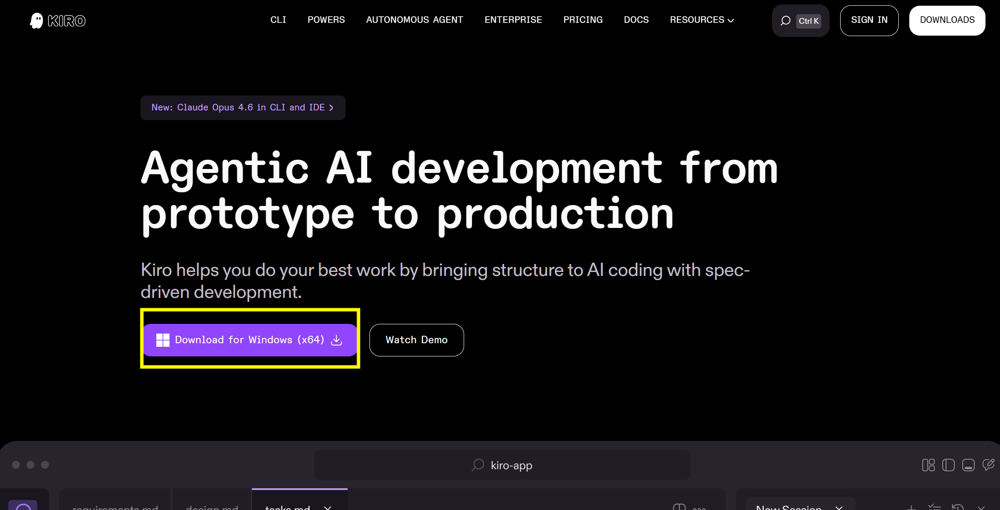
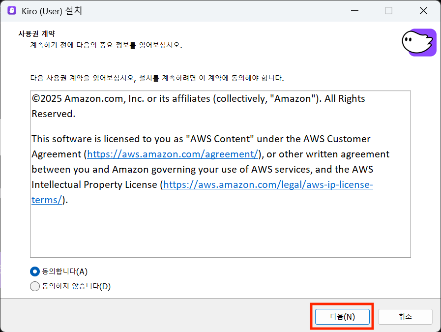
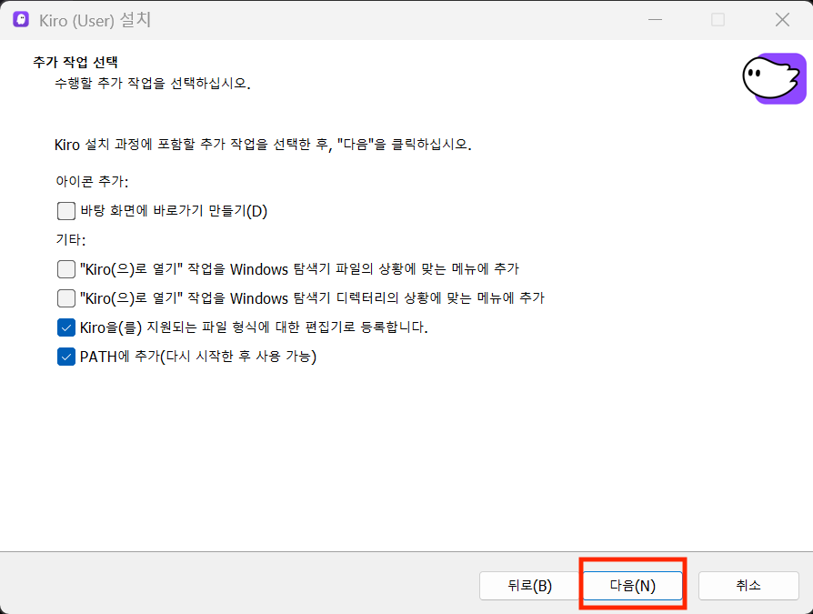
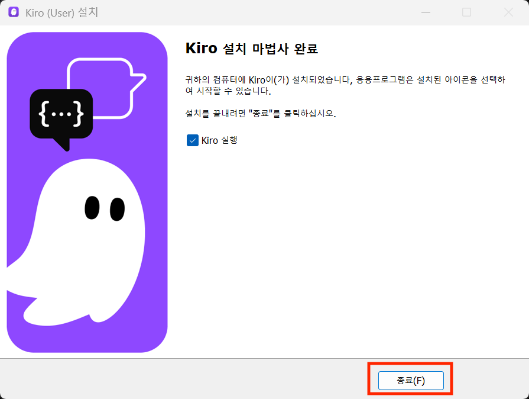
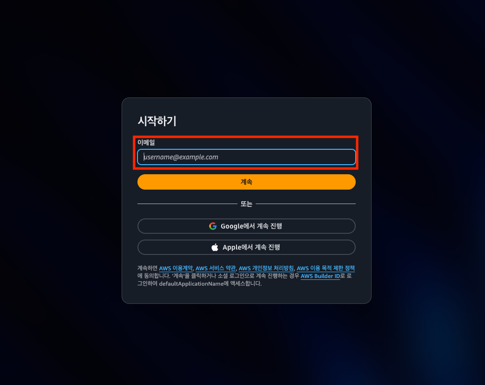
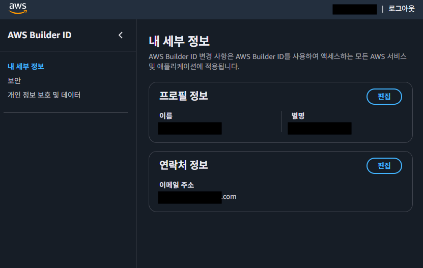
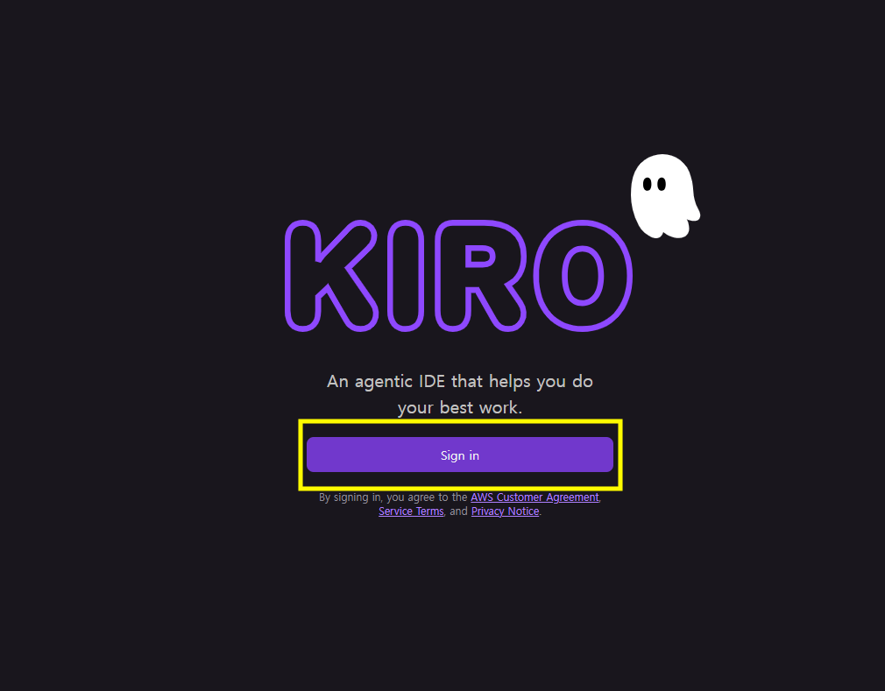
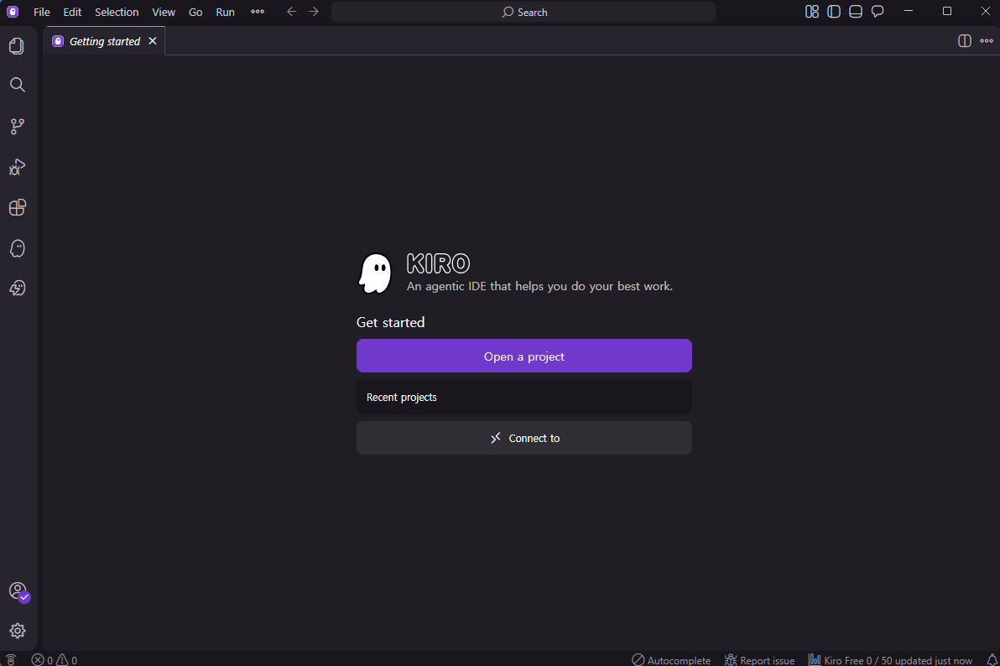
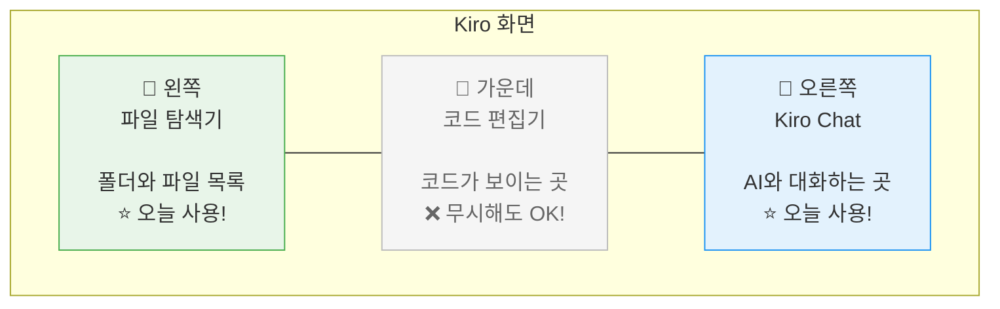

# ⚙️ 환경 설정

여기가 가장 중요한 단계입니다! 🔑\
차근차근 따라하시면 누구나 할 수 있어요. 천천히 가겠습니다!

---

## 📍 Step 1: Kiro 설치하기

아래 링크에서 Kiro를 다운로드하고 설치합니다. (일반 프로그램 설치와 동일합니다)

👉 [https://kiro.dev/](https://kiro.dev/)

<figure><figcaption></figcaption></figure>

* 메인 페이지에 보이는 다운로드 버튼을 클릭해 운영체제에 맞는 설치 파일을 다운받습니다.
* 다운로드한 설치 파일을 운영 체제에 맞는 방식으로 실행하여 설치를 시작합니다.

<figure><figcaption></figcaption></figure>

<figure><figcaption></figcaption></figure>

<figure><figcaption></figcaption></figure>

Kiro IDE를 실행하여 정상적으로 설치되었는지 확인합니다.

> **✅ 체크포인트**\
> Kiro 창이 열렸으면 이 단계는 성공입니다! 🎉

---

## 📍 Step 2: Kiro 로그인하기

Kiro는 다양한 로그인 방법을 제공합니다:

* **Google 계정**
* **GitHub 계정**
* **AWS Builder ID** (무료 생성 가능, 권장)
* **AWS SSO** (조직 계정)

### AWS Builder ID 로 로그인하기

이번 실습에서는 **AWS Builder ID**를 통해 Kiro에 대한 **무료 액세스**를 제공합니다.

AWS Builder ID는 AWS의 무료 개인 프로필로, AWS 계정 없이도 다양한 AWS 개발자 도구와 서비스를 사용할 수 있게 해줍니다.

**준비물**

* AWS Builder ID 등록을 위한 **유효한 이메일 주소**
* AWS 계정 불필요

#### 1. AWS Builder ID 생성

**1-1.** [AWS Builder ID 등록 페이지 ](https://profile.aws.amazon.com/)를 방문합니다.

<figure><figcaption></figcaption></figure>

**1-2.** **유효한 이메일 주소**를 입력한 뒤 **계속** 버튼을 클릭합니다.

**1-3.** 안내에 따라 계정을 생성합니다.

**1-4.** 입력한 이메일 주소를 인증합니다.

**1-5.** 계정 생성을 완료한 후 My details 페이지에서 AWS Builder ID의 세부 내용을 확인하실 수 있습니다.

<figure><figcaption></figcaption></figure>

> **등록 완료!**\
> AWS Builder ID가 성공적으로 생성되었습니다! 이제 이 계정으로 Kiro IDE 또는 Kiro CLI에 로그인할 수 있습니다.

#### 2. Kiro IDE 에서 AWS Builder ID로 로그인

**2-1.** Kiro IDE를 실행한 뒤 **Sign in** 버튼을 누릅니다.

<figure><figcaption></figcaption></figure>

**2-2.** 로그인 화면에서 **"AWS Builder ID"** 옵션을 선택합니다.

<figure><figcaption></figcaption></figure>

**2-3.** 방금 생성한 AWS Builder ID의 **이메일 주소**와 **비밀번호**를 입력하여 로그인을 진행합니다.

**2-4.** 필요한 경우 이메일로 전송된 추가 인증 코드를 입력합니다.

**2-5.** **"액세스 허용"** 버튼을 클릭하여 Kiro IDE가 데이터에 액세스하도록 허용합니다.

<figure><figcaption></figcaption></figure>

- "You can close this window" 같은 메시지가 나오면 **브라우저를 닫아도 됩니다**

**2-6.** 모든 과정이 끝나면 Kiro를 사용할 준비가 끝납니다.

<figure><figcaption></figcaption></figure>

> **✅ 체크포인트**\
> Kiro 우측 하단에 로그인 된 계정 정보가 보이면 성공입니다! 🎉

> **축하드립니다!🎉**\
> Kiro에 성공적으로 로그인했습니다! 이제 AI와 협업하는 개발 경험을 시작할 준비가 되었습니다.

> Kiro는 Visual Studio Code(VS Code)와 비슷하게 생긴 프로그램입니다. \
> VS Code 를 모르셔도, 처음 보셔도 당황하지 마세요! \
> 우리가 사용할 것은 **채팅창**뿐입니다.

---

## 📍 Step 3: 워크샵 프로젝트 열기

이제 오늘 사용할 프로젝트 폴더를 열어야 합니다.

### 3-1. "폴더 열기" 메뉴 찾기

1. Kiro 화면 **맨 위**에 있는 메뉴바를 봅니다
2. **File** (파일)을 클릭합니다
3. 나타나는 메뉴에서 **Open Folder...** (폴더 열기)를 클릭합니다

> **⚠️ 잠깐!**\
> Mac에서는 메뉴가 화면 **맨 위 상단바**에 있을 수 있어요. Kiro 창 안이 아니라 **화면 제일 위쪽**을 확인해보세요!

### 3-2. 프로젝트 폴더 선택하기

폴더 선택 창이 열리면:

1. **바탕화면** (Desktop)으로 이동합니다
2. **`gs25-ai-helper`** 라는 이름으로 새 폴더를 만들어 줍니다
3. **열기** (또는 **Select Folder**) 버튼을 클릭합니다

> **ℹ️ 참고**\
> 이후 진행될 모듈에서 이 폴더에 **샘플 규정 데이터 파일**을 넣어 테스트하게 됩니다.\
> (나중에 AI가 이 데이터를 읽어서 답변에 활용합니다!)

### 3-3. "이 폴더의 작성자를 신뢰하시나요?" 메시지

폴더를 열면 이런 메시지가 나올 수 있습니다:

**"Yes, I trust the authors"** (네, 신뢰합니다) 버튼을 클릭하세요.

> **ℹ️ 참고**\
> 이건 보안을 위한 질문이에요. 워크샵에서 쓰는 폴더이니 **안심하고 "Yes"** 를 눌러주세요! 😊

---

## 📍 Step 4: Kiro 화면 구성 알아보기 🖥️

프로젝트가 열리면 이제 Kiro 화면을 살펴봅시다!\
처음 보면 복잡해 보이지만, **오늘 쓸 영역은 딱 2개**뿐입니다! ✌️

### Kiro 화면 지도 🗺️

### 각 영역 자세히 보기

#### 1️⃣ 왼쪽: 파일 탐색기 📁 (오늘 사용합니다!)

- 프로젝트 안의 **폴더와 파일 목록**이 보입니다
- 파일을 **클릭**하면 가운데 영역에서 내용이 열립니다
- 오늘은 여기서 **`.kiro` 폴더** 안의 파일을 열어볼 거예요

> **ℹ️ 참고**\
> 파일 탐색기가 안 보인다면? 키보드에서 `Ctrl + B` (Mac: `Cmd + B`)를 눌러보세요!

#### 2️⃣ 가운데: 코드 편집기 📝 (무시해도 됩니다!)

- 파일을 클릭하면 여기에 내용이 표시됩니다
- 코드가 잔뜩 보여도 **놀라지 마세요!** 😅
- 코드는 **AI가 알아서 작성하는 영역**입니다
- 여러분이 직접 코드를 수정할 일은 없어요

> **✅ 기억하세요**\
> 가운데 영역에 어려운 코드가 보여도 **완전히 무시하셔도 됩니다!**\
> AI가 알아서 잘 만들고 있는 거예요 🤖

#### 3️⃣ 오른쪽: Kiro Chat 💬 (가장 중요합니다!)

- **AI와 대화하는 채팅 창**입니다
- 여기에 한국어로 원하는 것을 말하면 됩니다!
- 예시: "편의점 규정 검색 페이지 만들어줘"
- 카카오톡처럼 **아래쪽 입력창**에 메시지를 타이핑하고 **Enter**를 누르면 됩니다

> **⚠️ 잠깐! Kiro Chat이 안 보인다면?**\
> 1. 화면 오른쪽을 확인해보세요. 접혀있을 수 있습니다\
> 2. 상단 메뉴에서 **View** → **Kiro Chat** 을 클릭해보세요\
> 3. 그래도 안 보이면 진행자에게 물어보세요! 🙋

---

## ✅ 준비 완료 체크리스트

모든 준비가 끝났는지 하나씩 확인해볼까요? 🔍

| # | 확인 항목 | 체크 |
| --- | --- | --- |
| 1 | ✅ Kiro가 정상 실행된다 | ⬜ |
| 2 | ✅ AWS 계정 로그인이 완료되었다 | ⬜ |
| 3 | ✅ `gs25-ai-helper` 프로젝트가 열려있다 (왼쪽에 파일 목록이 보인다) | ⬜ |
| 4 | ✅ 오른쪽에 **Kiro Chat** 패널이 보인다 | ⬜ |

> **🎉 모두 체크되셨나요?**\
> 축하합니다! 환경 설정 완료! 👏👏👏\
> 이제 진짜 재미있는 부분이 시작됩니다!

> **😰 아직 안 된 항목이 있다면?**\
> 걱정하지 마세요! 바로 손을 들어 진행자에게 도움을 요청해주세요.\
> 다른 분들이 기다리는 것 같아 마음이 급해질 수 있지만, **괜찮습니다!** 모두 처음이에요 😊

---

👉 다음은 **Module 1: Steering** 입니다. AI에게 규칙을 알려주는 방법을 배워볼까요? 📏
