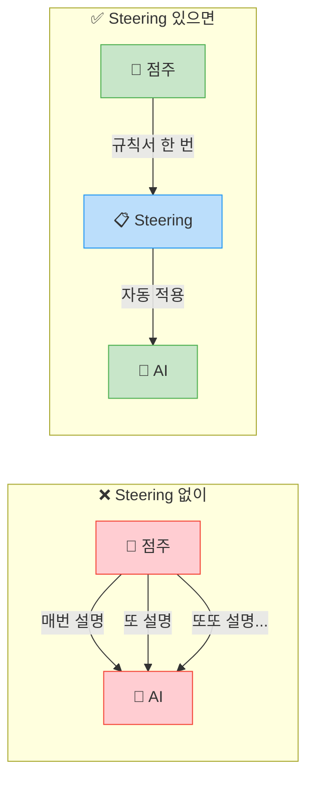

# 📏 Module 1: Steering - AI에게 규칙 알려주기

## 🎯 이번 Module에서 할 것

| 순서 | 내용 | 시간 | 난이도 |
| --- | --- | --- | --- |
| 1️⃣ | Steering이 뭔지 이해하기 | 10분 | ⭐ 매우 쉬움 |
| 2️⃣ | 우리 프로젝트의 Steering 작성하기 | 15분 | ⭐ 매우 쉬움 |

> **💪 이번 모듈은 정말 쉬워요!** \
> 파일 하나에 한국어로 규칙을 적는 게 전부입니다. 코드가 아니라 **그냥 글쓰기**예요!

---

## 🤔 Steering이 왜 필요한가요?

AI와 대화할 때 이런 경험 해보신 적 있으시죠? 😩

> "존댓말로 해줘"\
> "파란색으로 해줘"\
> "한국어로 해줘"\
> "답변은 3줄 이내로 해줘"

**매번 이런 말을 반복**해야 한다면 얼마나 귀찮을까요?

**Steering**에 한 번만 적어두면, AI가 **매번 알아서** 지킵니다! ✨

---

## 🏪 편의점으로 이해하는 Steering

이해하기 쉽게 편의점 상황으로 설명해드릴게요!

### 상황: 새 알바생이 왔다! 👋

여러분 점포에 새로운 알바생이 출근했다고 생각해보세요.

**Steering이 없는 경우** (= 운영 규칙서를 안 준 경우):

```
알바생: "손님이 반품하겠대요. 어떡해요?"
점주: "영수증 확인하고, 7일 이내인지 보고, 상품 상태 확인해"

알바생: "카드 단말기 에러 떠요!"
점주: "전원 끄고 다시 켜봐, 안 되면 본사 전화해"

알바생: "유통기한 지난 거 발견했어요!"
점주: "즉시 빼고 폐기 대장에 기록해"
```

😫 **매번 하나하나 알려줘야 해서 힘들죠?**

**Steering이 있는 경우** (= 운영 규칙서를 준 경우):

```
점주: "이거 운영 규칙서야. 읽어보고 이대로 하면 돼!"
알바생: "네! 알겠습니다!" (규칙서 보고 스스로 처리)
```

😊 **한 번만 알려주면 끝!**

### 이것이 바로 Steering입니다!



| | ❌ Steering 없이 | ✅ Steering 있으면 |
| --- | --- | --- |
| **색상** | 매번 "파란색으로 해줘" 말해야 함 | 항상 자동으로 GS25 파란색 |
| **언어** | 가끔 영어가 섞여 나옴 | 항상 한국어 |
| **답변 톤** | 반말이 나올 때도 있음 | 항상 존댓말 |
| **디자인** | 만들 때마다 다른 모습 | 항상 통일된 디자인 |
| **답변 길이** | 너무 길거나 짧거나 | 항상 적정 분량 |

> **✅ 핵심 정리**\
> **Steering = 우리 가게 운영 규칙서** 📋\
> 새로 온 알바생(AI)에게 "우리 가게는 이렇게 운영해"라고 알려주는 문서입니다.\
> 한 번 알려주면 매번 말 안 해도 규칙대로 일합니다!

---

## 📍 다음 단계

이제 Steering이 뭔지 아셨죠? 👍\
다음 페이지에서 **직접 Steering을 작성**해봅시다!

걱정 마세요 - 코드가 아니라 **한국어로 규칙을 적는 것**이 전부입니다! ✏️

---

👉 다음: **Steering이란?** - 조금 더 자세히 알아봅시다!
