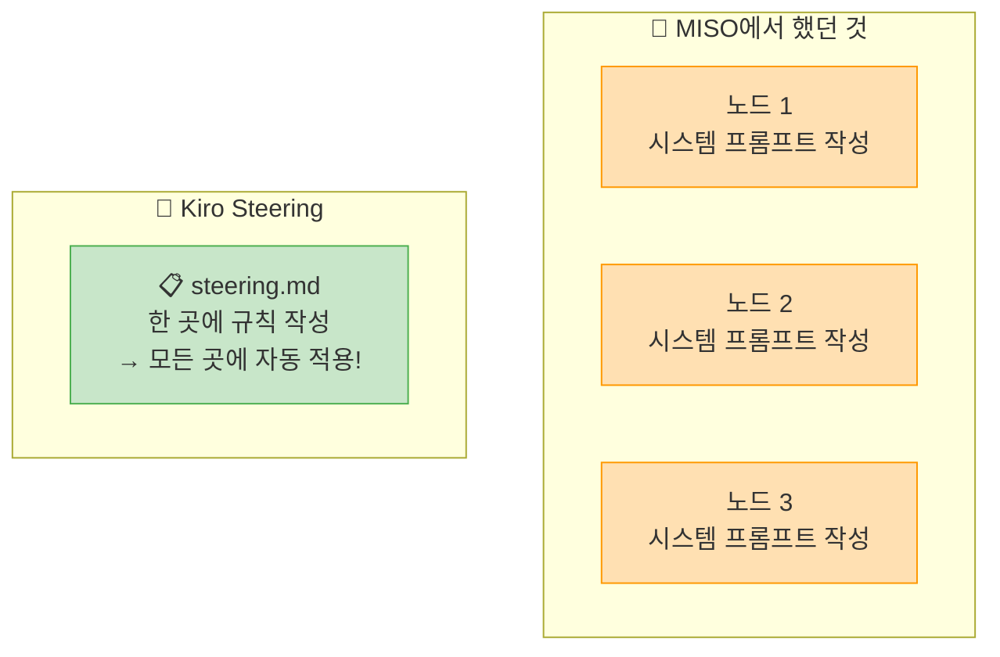
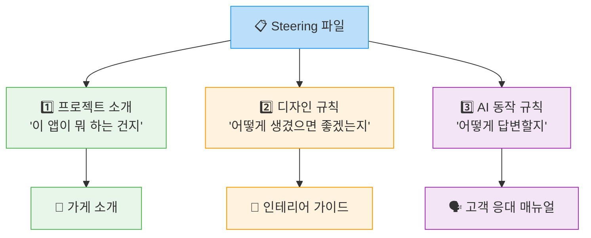

# 🔍 Steering이란?

## 한마디로 ✨

**Steering**은 AI에게 "이 프로젝트에서는 이렇게 해"라고 적어두는 **지침서**입니다.

한국어로 적으면 되고, 코드가 아닙니다! 그냥 **글쓰기**예요 ✏️

---

## 🎭 Steering이 있을 때 vs 없을 때

같은 요청을 해도 Steering이 있고 없고에 따라 **결과가 완전히 달라집니다!**

### ❌ Steering 없이 요청한 경우

> 👤 나: "편의점 규정 검색 페이지 만들어줘"

AI가 만든 결과:

| 문제 | 예시 |
| --- | --- |
| 🎨 디자인이 매번 달라짐 | 어떨 때는 빨간색, 어떨 때는 초록색... |
| 🌐 영어가 섞여 나옴 | "Search" 버튼, "Submit" 버튼... |
| 🗣️ 답변 톤이 일정하지 않음 | 어떨 때는 반말, 어떨 때는 존댓말 |
| 📱 모바일 고려 안 됨 | 핸드폰으로 보면 글자가 삐져나옴 |


### ✅ Steering 있는 경우

> 📋 **Steering에 미리 적어둔 것:**
> - GS25 파란색(#0066CC) 사용
> - 모든 텍스트는 한국어
> - 항상 존댓말
> - 모바일에서도 잘 보이게

> 👤 나: "편의점 규정 검색 페이지 만들어줘"

AI가 만든 결과:

| 항목 | 결과 |
| --- | --- |
| 🎨 색상 | ✅ 항상 GS25 파란색이 적용됨 |
| 🇰🇷 언어 | ✅ 모든 텍스트가 한국어 |
| 🗣️ 톤 | ✅ 답변이 항상 존댓말 |
| 📱 모바일 | ✅ 핸드폰에서도 잘 보임 |


### 👀 실제 대화 비교해보기

같은 질문인데 결과가 이렇게 다릅니다:

**❌ Steering 없는 경우의 AI 답변:**
```
Q: 유통기한 지난 음료 어떻게 해?
A: Remove expired products from the shelf immediately.
   폐기 처리하면 됩니다.
```
→ 영어가 섞이고, 반말이 나오고, 규정 번호도 없음 😞

**✅ Steering 있는 경우의 AI 답변:**
```
Q: 유통기한 지난 음료 어떻게 해?
A: 유통기한이 경과한 음료는 즉시 진열대에서 제거하신 후,
   폐기 대장에 기록해주세요. (규정 제3-2-1조)
   추가 질문이 있으시면 말씀해주세요!
```
→ 한국어, 존댓말, 규정 번호 포함! 완벽해요! 🎉

> **✅ 핵심 포인트**\
> Steering = 한 번 쓰면 매번 반복하지 않아도 되는 **자동 적용 규칙** 🔄

---

## 🔄 MISO에서의 경험과 비교

여러분이 MISO에서 해보셨던 것과 비교하면 이해가 더 쉬울 거예요!



| | 🧩 MISO | 🚀 Kiro Steering |
| --- | --- | --- |
| **지침 작성 위치** | 각 노드마다 시스템 프롬프트를 따로 작성 | **한 곳**에 작성하면 **전체에** 적용 |
| **수정할 때** | 노드 하나하나 찾아서 수정 | 파일 **하나만** 수정하면 끝 |
| **적용 범위** | 해당 워크플로우 안에서만 동작 | 코드, 디자인, 답변 등 **모든 작업에** 적용 |
| **편의점 비유** | 각 코너마다 다른 규칙 붙여놓기 | 점포 운영 규칙서 **한 권** 만들기 📖 |

> **ℹ️ 참고**\
> MISO에서는 노드마다 따로따로 규칙을 적어야 했죠?\
> Kiro에서는 **딱 한 번만** 적으면 됩니다! 훨씬 편하죠? 😊

---

## 📝 Steering에는 뭘 적나요?

크게 **3가지**를 적습니다. 하나씩 살펴볼까요?

### 1️⃣ 프로젝트 소개 - "이 앱이 뭐 하는 건지" 알려주기

> 💡 편의점 비유: 가게 소개 ("우리는 GS25 ○○점입니다")

```
이 프로젝트는 GS25 편의점 점주를 위한 규정 검색 도우미입니다.
470페이지 매뉴얼을 뒤지는 대신, 질문 한 마디로 규정을 찾아줍니다.
```

**왜 필요한가요?** AI가 "아~ 이건 편의점 규정을 찾아주는 앱이구나!" 하고 이해합니다.\
편의점과 관련 없는 엉뚱한 답변을 하지 않게 됩니다!

### 2️⃣ 디자인 규칙 - "어떻게 생겼으면 좋겠는지" 알려주기

> 💡 편의점 비유: 인테리어 가이드 ("간판은 파란색, 조명은 밝게")

```
메인 색상: GS25 파란색 (#0066CC)
모든 텍스트는 한국어
둥근 모서리와 그림자가 있는 카드형 디자인
```

**왜 필요한가요?** 매번 "파란색으로 해줘" 라고 안 해도 됩니다!\
앱의 모든 화면이 **통일된 디자인**으로 만들어집니다.

### 3️⃣ AI 동작 규칙 - "어떻게 답변할지" 알려주기

> 💡 편의점 비유: 고객 응대 매뉴얼 ("항상 존댓말, 인사는 이렇게")

```
항상 존댓말로 답변
답변은 3줄 이내로 요약
관련 규정 번호를 반드시 포함
```

**왜 필요한가요?** AI가 항상 **정해진 톤과 형식**으로 답변합니다.\
마치 잘 교육받은 직원처럼요! 👨‍💼

---

## 📊 정리: Steering = 3가지 규칙



> **💪 자신감을 가지세요!**\
> Steering은 코드가 아닙니다. **한국어로 규칙을 적는 것**이 전부예요!\
> 다음 페이지에서 직접 작성해볼 건데, 정말 쉽습니다! 😊

---

👉 다음: **Steering 직접 작성하기** - 드디어 실습입니다! ✏️
