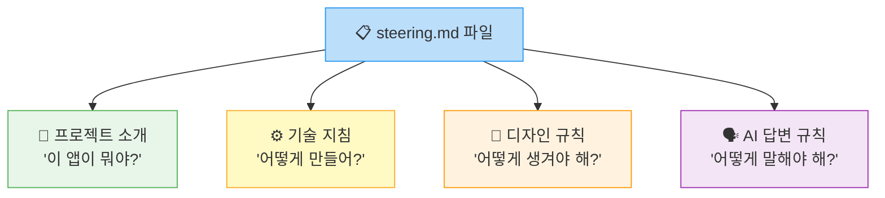

# ✏️ Steering 작성하기

드디어 실습 시간입니다! 🎉\
걱정 마세요 - 파일 하나에 한국어로 규칙을 적는 게 전부입니다!

---

## 📍 Step 1: Steering 파일 열기

### 1-1. 왼쪽 파일 탐색기에서 `.kiro` 폴더 찾기

Kiro 화면 **왼쪽**에 있는 파일 탐색기를 봐주세요.


여러 폴더와 파일이 보일 텐데, 그 중에서 **`.kiro`** 라는 폴더를 찾습니다.

> **⚠️ 잠깐! `.kiro` 폴더가 안 보인다면?**\
> `.`(점)으로 시작하는 폴더는 숨김 폴더라서 안 보일 수 있어요!\
> \
> 해결 방법:\
> 1. 파일 탐색기 영역에서 **마우스 오른쪽 버튼**을 클릭합니다\
> 2. 또는 진행자에게 "점키로 폴더가 안 보여요!" 라고 말씀해주세요 🙋

### 1-2. `.kiro` 폴더 열기

1. `.kiro` 폴더 왼쪽의 **▶ 화살표**를 클릭합니다 (또는 폴더를 더블클릭)
2. 폴더가 열리면서 안에 있는 파일이 보입니다
3. **`steering.md`** 파일을 찾습니다


### 1-3. `steering.md` 파일 열기

**`steering.md`** 파일을 **클릭**합니다.

가운데 편집기 영역에 파일 내용이 열립니다.\
(비어있거나 기본 내용이 있을 수 있어요)


> **ℹ️ 참고**\
> `.kiro/steering.md` 는 특별한 파일입니다!\
> Kiro가 프로젝트를 열 때 **자동으로 이 파일을 읽고** 기억합니다.\
> 여기에 적은 규칙은 AI가 코드를 만들 때 **항상** 참고해요. 마치 알바생이 출근할 때마다 운영 규칙서를 확인하는 것처럼! 📋

---

## 📍 Step 2: Steering 내용 작성하기

이제 파일에 내용을 적을 차례입니다!\
아래 내용을 **통째로 복사**해서 `steering.md` 파일에 **붙여넣기**하세요.

### 복사하는 방법 📋

1. 아래 코드 블록의 내용을 **마우스로 전체 선택** (드래그)합니다
2. `Ctrl + C` (Mac: `Cmd + C`)로 **복사**합니다
3. Kiro의 steering.md 파일 편집기를 클릭합니다
4. 기존 내용이 있다면 `Ctrl + A` (Mac: `Cmd + A`)로 전체 선택 후
5. `Ctrl + V` (Mac: `Cmd + V`)로 **붙여넣기**합니다

**📋 아래 내용을 복사해서 붙여넣기**

```markdown
# GS25 규정 도우미 프로젝트

## 프로젝트 소개
이 프로젝트는 GS25 편의점 점주를 위한 규정 검색 도우미 웹앱입니다.
470페이지 운영 매뉴얼을 뒤지는 대신, 질문 한 마디로 필요한 규정을 찾아줍니다.

## 기술 지침
- 하나의 HTML 파일로 간단하게 작성
- 모바일에서도 잘 보이는 반응형 디자인

## 디자인 규칙
- 메인 색상: GS25 파란색 (#0066CC)
- 보조 색상: 밝은 회색 (#F5F5F5)
- 폰트: 시스템 기본 폰트 (별도 웹폰트 불필요)
- 둥근 모서리와 그림자를 사용한 카드형 디자인
- 모든 텍스트는 한국어

## AI 답변 규칙
- 항상 존댓말로 답변
- 답변은 3줄 이내로 요약
- 관련 규정 조항 번호를 반드시 포함
- 모르는 질문에는 "본사 담당부서(내선 XXXX)에 문의해주세요"로 안내
- 답변 끝에 "추가 질문이 있으시면 말씀해주세요" 문구 추가
```


> **⚠️ 잠깐! 잘 붙여넣어졌는지 확인하세요!**\
> - `# GS25 규정 도우미 프로젝트` 로 시작하나요? ✅\
> - 마지막 줄이 `답변 끝에 "추가 질문이 있으시면 말씀해주세요" 문구 추가` 인가요? ✅\
> - 내용이 잘려있지 않나요? ✅

---

## 📍 Step 3: 각 부분이 하는 역할 이해하기 🧐

방금 붙여넣은 내용이 각각 어떤 역할을 하는지 알아봅시다!

### 📌 프로젝트 소개 부분

```markdown
## 프로젝트 소개
이 프로젝트는 GS25 편의점 점주를 위한 규정 검색 도우미 웹앱입니다.
470페이지 운영 매뉴얼을 뒤지는 대신, 질문 한 마디로 필요한 규정을 찾아줍니다.
```

> 🏪 **편의점 비유**: 가게 소개 - "우리는 GS25 ○○점입니다"\
> \
> **왜 필요해요?** AI에게 "너는 편의점 규정 찾아주는 일을 할 거야" 라고 알려주는 거예요.\
> 이걸 안 적으면 AI가 엉뚱한 방향으로 갈 수 있어요!

### 📌 기술 지침 부분

```markdown
## 기술 지침
- 하나의 HTML 파일로 간단하게 작성
- 모바일에서도 잘 보이는 반응형 디자인
```

> 🏪 **편의점 비유**: 설비 규격 - "진열대는 이 규격으로"\
> \
> **왜 필요해요?** AI에게 "앱을 심플하게, 핸드폰에서도 보이게 만들어" 라고 알려주는 거예요.\
> "HTML"이 뭔지 몰라도 괜찮아요! AI가 알아서 처리합니다 😊

### 📌 디자인 규칙 부분

```markdown
## 디자인 규칙
- 메인 색상: GS25 파란색 (#0066CC)
- 보조 색상: 밝은 회색 (#F5F5F5)
- 폰트: 시스템 기본 폰트 (별도 웹폰트 불필요)
- 둥근 모서리와 그림자를 사용한 카드형 디자인
- 모든 텍스트는 한국어
```

> 🏪 **편의점 비유**: 인테리어 가이드 - "간판은 파란색, 조명은 밝게"\
> \
> **왜 필요해요?** AI가 만드는 앱의 색상과 모양을 통일시키는 거예요.\
> `#0066CC` 는 파란색을 컴퓨터가 이해하는 방식으로 적은 것입니다. (몰라도 돼요! 그냥 "파란색"이라고 생각하세요 💙)

### 📌 AI 답변 규칙 부분

```markdown
## AI 답변 규칙
- 항상 존댓말로 답변
- 답변은 3줄 이내로 요약
- 관련 규정 조항 번호를 반드시 포함
- 모르는 질문에는 "본사 담당부서(내선 XXXX)에 문의해주세요"로 안내
- 답변 끝에 "추가 질문이 있으시면 말씀해주세요" 문구 추가
```

> 🏪 **편의점 비유**: 고객 응대 매뉴얼 - "항상 존댓말, 모르면 본사 연결"\
> \
> **왜 필요해요?** 앱 안에서 AI가 어떤 말투로, 어떤 형식으로 답할지 정하는 거예요.\
> 이걸 안 정하면 AI가 가끔 반말하거나, 너무 길게 답하거나 할 수 있어요!

### 전체 구조 한눈에 보기



---

## 📍 Step 4: 저장하기 💾

이제 파일을 저장합니다!

**Windows**: `Ctrl` 키를 누른 상태에서 `S` 키를 누릅니다\
**Mac**: `Cmd` 키를 누른 상태에서 `S` 키를 누릅니다


> **⚠️ 잠깐! 저장이 됐는지 확인하는 방법**\
> 파일 탭(위쪽에 `steering.md`라고 적힌 탭)을 봐주세요.\
> - 파일명 옆에 **흰색 동그라미(●)**가 보이면 → 아직 저장 안 됨! ❌\
> - 동그라미가 **없으면** → 저장 완료! ✅


---

## ✅ 잘 됐는지 확인하기 (중요!)

제대로 했는지 같이 확인해볼까요? 🔍

### 체크리스트

| # | 확인 항목 | 체크 |
| --- | --- | --- |
| 1 | 왼쪽 파일 탐색기에서 `.kiro` > `steering.md` 파일이 열려있다 | ⬜ |
| 2 | 파일 내용이 `# GS25 규정 도우미 프로젝트`로 시작한다 | ⬜ |
| 3 | 프로젝트 소개, 기술 지침, 디자인 규칙, AI 답변 규칙 - 4개 섹션이 모두 있다 | ⬜ |
| 4 | 파일이 저장되었다 (탭에 ● 표시가 없다) | ⬜ |

### 직접 확인하는 방법

Kiro Chat에서 이렇게 물어보세요:

```
이 프로젝트의 메인 색상이 뭐야?
```

AI가 **"GS25 파란색 (#0066CC)입니다"** 같은 답변을 하면 → **Steering이 잘 적용된 것입니다!** 🎉

AI가 엉뚱한 답을 하면 → steering.md 파일이 저장되었는지 다시 확인해보세요!


> **🎉 축하합니다!**\
> 이제 이 프로젝트에서 AI에게 무엇을 요청하든, 방금 적은 규칙이 **자동으로 적용**됩니다!\
> "파란색으로 해줘", "존댓말로 해줘"를 매번 말할 필요가 없어요! 편하죠? 😊

---

## 🎁 (보너스) Steering을 바꾸면 어떻게 될까?

나중에 Module 2에서 앱을 만든 후, Steering을 수정해보는 실험을 할 겁니다.\
미리 맛보기를 보여드릴게요! 👀

### 예시: AI 답변 규칙을 이렇게 바꾸면?

**📋 바꾸기 전 (지금 적은 것)**
```markdown
## AI 답변 규칙
- 항상 존댓말로 답변
- 답변은 3줄 이내로 요약
- 관련 규정 조항 번호를 반드시 포함
```

**📋 바꾼 후**
```markdown
## AI 답변 규칙
- 친근한 반말 사용
- 답변에 이모지를 넣어서 재미있게
- 최대한 상세하게 설명
```

### 결과 비교 🔄

| | 바꾸기 전 | 바꾼 후 |
| --- | --- | --- |
| **답변 예시** | "유통기한 경과 상품은 즉시 제거해주세요. (규정 제3-2-1조)" | "유통기한 지났으면 바로 빼! 🏃‍♂️ 폐기대장에 적어두는 거 잊지 마~ 📝" |
| **톤** | 공식적, 존댓말 | 친근한, 반말 |
| **길이** | 짧고 간결 | 상세하게 설명 |

**같은 앱인데 답변 톤이 완전히 바뀝니다!** 😮\
이건 잠시 후에 직접 체험해보겠습니다. 기대해주세요! 🎬

> **ℹ️ 참고**\
> 지금은 바꾸지 마세요! 원래 내용 그대로 두고 다음 Module로 넘어갑시다.\
> Module 2에서 앱을 만든 후에 실험할 거예요! 🧪

---

👉 다음은 **Module 2: 바이브 코딩** 입니다. 드디어 말로 앱을 만들어봅니다! 💬🚀
