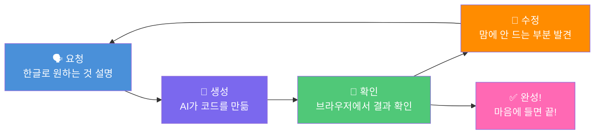

# Module 2: 바이브 코딩 - 말로 앱 만들기 🚀

## 🎯 이번 Module에서 할 것

드디어 **직접 앱을 만드는 시간**입니다!
걱정 마세요, 코드를 한 글자도 쓰지 않습니다. **한글로 말하면** AI가 다 만들어줍니다. 😊

| 순서 | 내용 | 시간 | 난이도 |
| --- | --- | --- | --- |
| 1 | 🎬 첫 번째 프롬프트로 앱 생성 | 15분 | ⭐ 쉬움 |
| 2 | 🎨 대화로 다듬기 (디자인, 기능 수정) | 20분 | ⭐ 쉬움 |
| 3 | 📂 @파일로 규정 데이터 연결하기 | 15분 | ⭐⭐ 보통 |

> **ℹ️ 참고**
> 위 시간은 대략적인 기준입니다. 천천히 하셔도 됩니다!
> 모르는 부분은 언제든 손 들어서 진행자에게 물어보세요. 🙋

***

## 🤔 바이브 코딩이란?

### 한 줄 요약

**바이브 코딩(Vibe Coding)** = 코드를 직접 쓰지 않고, **한글 대화**로 AI에게 앱을 만들게 하는 방식

### 쉬운 비유로 이해하기

카페에서 커피를 주문할 때를 생각해보세요 ☕

- ❌ 직접 에스프레소 머신을 작동시키고, 우유를 스팀하고, 시럽을 넣고...
- ✅ "아이스 바닐라 라떼 하나 주세요!" 라고 **말로 주문**합니다

**바이브 코딩도 똑같습니다!**

- ❌ 코드를 한 줄 한 줄 직접 쓰고, 에러를 찾고, 디자인을 수정하고...
- ✅ "채팅형 규정 검색 웹페이지 만들어줘!" 라고 **말로 주문**합니다

> **ℹ️ MISO 경험자분들께**
> MISO에서 프롬프트로 에이전트 워크플로우를 만들었던 경험, 기억나시죠?
> **그 경험 그대로 활용하시면 됩니다!** 👍
> 다만 MISO에서는 보이지 않는 에이전트 로직을 만들었다면,
> 여기서는 **눈에 보이는 앱 화면**을 만듭니다.

### 기존 코딩 vs 바이브 코딩 비교

| | 🔧 기존 코딩 | 🗣️ 바이브 코딩 |
| --- | --- | --- |
| **만드는 방법** | 개발자가 코드를 한 줄씩 영어로 작성 | **한글**로 "이런 거 만들어줘" 요청 |
| **버그 수정** | 코드를 읽고 직접 원인을 찾아서 수정 | "이 부분이 이상해, 고쳐줘" **대화** |
| **디자인 변경** | CSS라는 언어로 색상, 크기 등을 조정 | "좀 더 깔끔하게 바꿔줘" **요청** |
| **필요한 지식** | 프로그래밍 언어 최소 1~2개 | **한국어 능력 + 원하는 것을 설명하는 능력** |
| **걸리는 시간** | 하루~며칠 | **몇 분~몇 십 분** |

***

## 🔄 바이브 코딩의 흐름

바이브 코딩은 한 번에 완벽하게 만들지 않습니다.
**대화를 주고받으며 점점 완성**해 나가는 과정입니다!

이 사이클을 **계속 반복**하면서 앱이 점점 좋아집니다!

> **잠깐! 💡**
> 한 번에 완벽한 결과를 기대하지 마세요!
> 프로 개발자들도 바이브 코딩할 때 **5~10번은 수정 요청**을 합니다.
> 수정을 많이 한다고 실력이 없는 게 아니에요. **그게 정상**입니다! 😉

***

## 📝 프롬프트 주문서 (치트시트)

막힐 때 이 표를 보고 **따라 쓰시면 됩니다!**
"어떻게 말해야 하지?" 고민될 때 아래 예시를 참고하세요.

### 🏗️ 처음 만들 때 (기본 주문)

| 이렇게 말하면 | AI가 이렇게 해줍니다 |
| --- | --- |
| "~하는 웹페이지 만들어줘" | 새 웹페이지를 처음부터 만들어줌 |
| "채팅 화면이 있는 앱을 만들어줘" | 채팅 UI가 포함된 페이지를 만들어줌 |
| "데이터를 표로 보여주는 대시보드 만들어줘" | 표와 차트가 있는 대시보드를 만들어줌 |
| "로그인 화면을 만들어줘" | 아이디/비밀번호 입력 화면을 만들어줌 |

### 🎨 디자인 수정

| 이렇게 말하면 | AI가 이렇게 해줍니다 |
| --- | --- |
| "배경색을 흰색으로 바꿔줘" | 배경 색상이 바뀜 |
| "글자 크기를 좀 더 크게 해줘" | 텍스트가 더 커짐 |
| "버튼을 둥글게 만들어줘" | 버튼 모서리가 둥글어짐 |
| "GS25 파란색으로 맞춰줘" | 브랜드 색상으로 변경됨 |
| "좀 더 깔끔하게 / 모던하게 바꿔줘" | 전체적인 디자인이 세련되게 바뀜 |
| "카드 형태로 만들어줘" | 콘텐츠가 카드 레이아웃으로 바뀜 |

### ⚙️ 기능 추가/수정

| 이렇게 말하면 | AI가 이렇게 해줍니다 |
| --- | --- |
| "버튼 3개 추가해줘" | 버튼이 추가됨 |
| "클릭하면 ~하게 해줘" | 클릭 동작이 추가됨 |
| "로딩 중 표시를 넣어줘" | 로딩 애니메이션이 추가됨 |
| "입력하면 자동으로 검색되게 해줘" | 실시간 검색 기능이 추가됨 |
| "다크 모드 토글 버튼을 넣어줘" | 밝은/어두운 모드 전환이 됨 |

### 💬 말투/톤 변경

| 이렇게 말하면 | AI가 이렇게 해줍니다 |
| --- | --- |
| "답변을 좀 더 친근하게 바꿔줘" | 딱딱한 말투 → 친근한 말투 |
| "이모지를 넣어서 답변해줘" | 이모지가 포함된 답변 |
| "간결하게 핵심만 답변하게 해줘" | 길고 장황한 답변 → 짧고 핵심적인 답변 |
| "존댓말로 답변하게 해줘" | 반말 → 존댓말 |

### 📱 레이아웃/반응형

| 이렇게 말하면 | AI가 이렇게 해줍니다 |
| --- | --- |
| "모바일에서도 잘 보이게 해줘" | 핸드폰 화면 크기에 맞게 조정됨 |
| "왼쪽에 메뉴를 넣어줘" | 사이드바 메뉴가 추가됨 |
| "화면을 2분할로 나눠줘" | 좌우 또는 상하로 나뉨 |

### 🔗 데이터 연결

| 이렇게 말하면 | AI가 이렇게 해줍니다 |
| --- | --- |
| "@파일명 이 데이터 기반으로 답변해줘" | 해당 파일의 데이터를 활용 |
| "@파일명 이 파일 내용을 표로 보여줘" | 파일 데이터가 표로 표시됨 |
| "데이터에 없으면 '모르겠습니다'라고 해줘" | 없는 정보에 대해 솔직하게 답변 |

### 🛠️ 문제 해결

| 이렇게 말하면 | AI가 이렇게 해줍니다 |
| --- | --- |
| "이 부분이 이상해, 고쳐줘" | 문제를 찾아서 수정 |
| "아까 잘 되던 거 안 돼, 되돌려줘" | 이전 상태로 복원 |
| "계속해줘" / "이어서 만들어줘" | 멈춘 작업을 이어서 진행 |
| "에러가 나는데 확인해줘" | 에러 원인을 찾아서 수정 |

> **잠깐! 💡 프롬프트 작성 꿀팁**
> 1. **구체적으로** 쓰세요 — "좋게 만들어줘" ❌ → "GS25 파란색 배경에 흰 글자로 바꿔줘" ✅
> 2. **한 번에 하나씩** 요청하세요 — 한꺼번에 10가지 바꾸면 AI도 헷갈려요!
> 3. **원하는 모습을 상상**하고 그 모습을 설명하세요
> 4. 잘 안 되면 **다른 표현으로** 다시 시도해보세요

***

자, 이제 준비가 되셨나요? 다음 페이지에서 **첫 번째 프롬프트를 입력**합니다! 🎬
