# #파일로 데이터 연결하기 📂

## 🤔 지금까지의 한계

지금까지 만든 앱은 보기에는 그럴듯하지만... **한 가지 큰 문제**가 있습니다.

질문을 하면 AI가 **일반적인 지식으로 추측해서** 답변합니다.    
실제 GS25 규정이 아니라, AI가 "아마 이렇겠지?" 하고 **지어낸 내용**이에요! 😱

> 🤔 "진짜 우리 회사 규정 데이터를 넣을 수는 없을까?"

**됩니다!** 🎉 그것도 아주 쉽게요!

***

## 💡 #파일이란? — 쉬운 비유로 이해하기

### 신입 알바생에게 매뉴얼 주기 📖

이렇게 상상해보세요:

**상황 1: 매뉴얼 없는 신입 알바생** 😰
> 손님: "이 상품 반품하고 싶은데요"   
> 알바생: "음... 아마 영수증 가져오시면 될 거예요..." (추측!)    
> → 잘못된 안내로 클레임 발생! 😫   

**상황 2: 매뉴얼 받은 신입 알바생** 😊
> 점주님이 **470페이지 운영 매뉴얼**을 알바생 앞에 탁! 놓아줌 📚   
> 손님: "이 상품 반품하고 싶은데요"    
> 알바생: (매뉴얼 펼쳐봄) "규정 #12에 따르면 입고 72시간 이내 반품 가능하시고요..." ✅    
> → 정확한 안내! 👍   
 
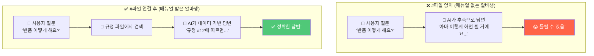

**`#파일`은 바로 이 매뉴얼을 AI에게 건네주는 것입니다!**

| MISO에서는 | Kiro에서는 |
| --- | --- |
| Knowledge Base에 문서를 업로드 📤 | 프로젝트 폴더에 파일을 넣고 `#파일명`으로 참조 |
| 같은 개념이에요! 방식만 다를 뿐! 😊 | |

***

## Step 1: 샘플 데이터 확인하기 🔍

실습에 사용될 샘플 데이터를 다운로드 받습니다. 🧑‍🏫     
[샘플 데이터 다운로드 링크](http://d2sy15d9q06k5e.cloudfront.net/52g-workshop/regulations.md)

한번 열어서 어떤 내용이 들어있는지 살펴볼까요?

### 1-1. data 폴더 찾기

화면 왼쪽의 **파일 탐색기**에서 `data` 폴더를 만들어주세요.    
- 파일 탐색기 영역의 빈 공간에 대고 마우스 우클릭하고
- `New Folder` 를 선택합니다.
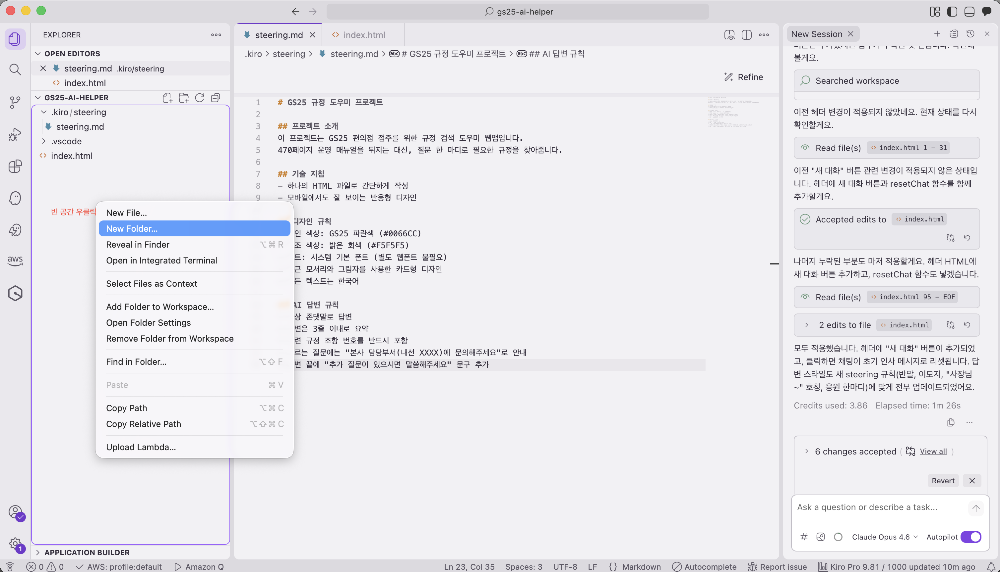
- 폴더명을 `data`로 입력하고 엔터를 칩니다.   
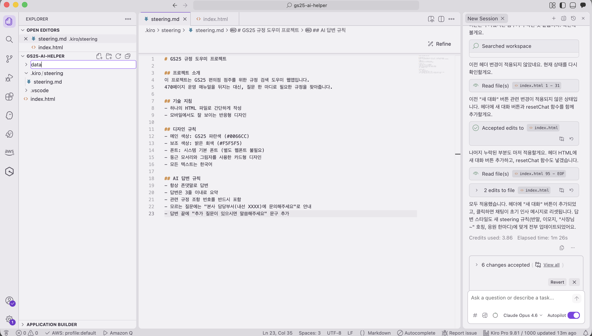


### 1-2. 규정 파일 열어보기

`data` 폴더 안에 다운로드 받은 파일을 드래그 앤 드랍해서 넣습니다.
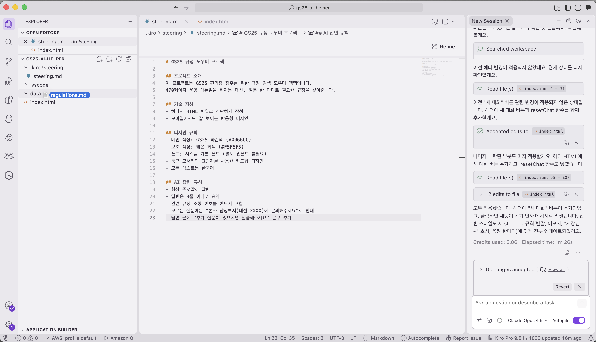

| 파일명 | 어떤 내용인가요? |
| --- | --- |
| `regulations.md` | 📋 편의점 운영 규정 FAQ 20개 — 반품, 유통기한, 근무 규정 등 |


**`regulations.md` 파일을 클릭**해서 한번 읽어보세요.

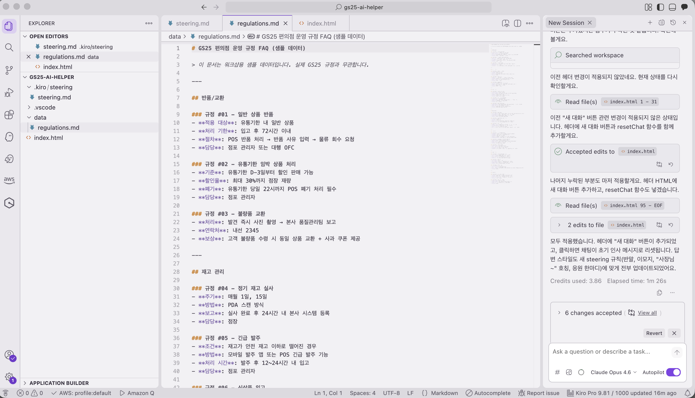

어떤 내용이 들어있는지 대략 훑어보셨나요?  
이 데이터를 AI에게 건네줄 거예요! 📚➡️🤖

***

## Step 2: #파일로 데이터 연결하기 🔗

이제 진짜 핵심입니다!   
AI에게 "이 규정 파일을 읽고, 이걸 기반으로 답변해!" 라고 알려주겠습니다.

### 2-1. #파일 사용법

Kiro Chat에서 `#` 기호를 입력하면 특별한 일이 일어납니다!


`#`는 AI에게 **"이 파일을 읽어봐!"** 라고 알려주는 특별한 기호입니다.

### 2-2. 프롬프트 입력하기

**📋 Kiro Chat에 입력**

```
#data/regulations.md 이 파일에 있는 규정 데이터를 기반으로 답변하도록 앱을 수정해줘.

- 사용자가 질문하면 이 데이터에서 가장 관련 있는 규정을 찾아서 답변
- 데이터에 없는 질문이면 "해당 규정은 등록되지 않았습니다. 본사에 문의해주세요"로 안내
- 답변할 때 규정 번호와 카테고리도 함께 표시
```

> **ℹ️ #를 입력할 때 팁**     
> `#`를 입력하면 **파일 목록이 자동으로** 나타납니다.    
> 목록에서 `data/regulations.md`를 **클릭**하면 자동으로 입력돼요!     
> 물론 직접 `#data/regulations.md`라고 타이핑해도 됩니다.  

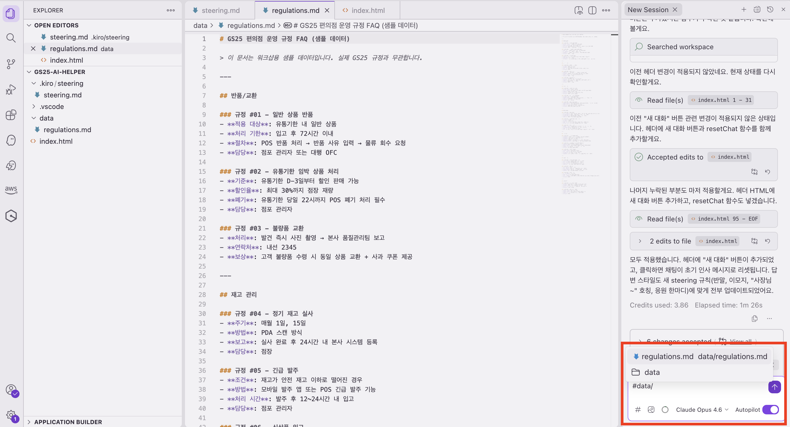
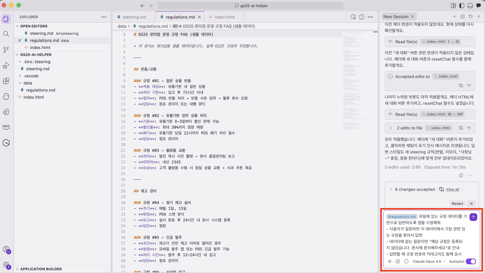


### 🔍 프롬프트 각 부분의 의미

| 우리가 쓴 부분 | 의미 |
| --- | --- |
| `#data/regulations.md` | 📂 "이 파일을 읽어봐" — AI에게 데이터를 건네줌 |
| "이 파일에 있는 규정 데이터를 기반으로 답변하도록" | 🎯 "이 데이터를 근거로 답변해" — 추측하지 말라는 지시 |
| "데이터에 없는 질문이면 ~ 안내" | 🚫 "모르는 건 모른다고 해" — 거짓말하지 말라는 지시 |
| "규정 번호와 카테고리도 함께 표시" | 🏷️ "출처도 같이 보여줘" — 답변의 신뢰도를 높이는 지시 |

Enter를 누르고 AI가 코드를 수정할 때까지 기다려주세요... ⏳

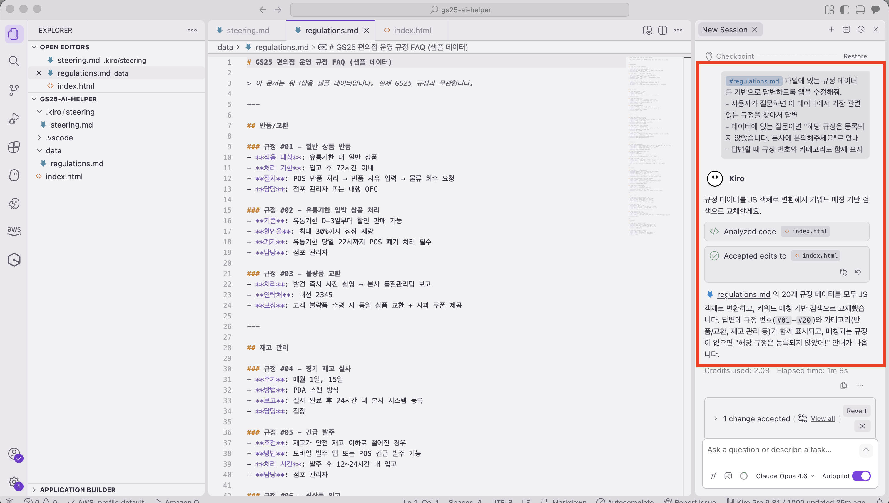
***

## Step 3: 결과 확인하기 — Before vs After 🔍

AI가 수정을 완료하면, **같은 질문을 해서 달라진 점을 확인**합니다!

### 3-1. 테스트 질문하기

브라우저에서 앱을 열고, 이 질문을 입력해보세요:

**"반품 절차가 어떻게 되나요?"**

### 3-2. Before vs After 비교

> 💬 **Before (#파일 연결 전)의 답변**
>
> "반품 절차는 일반적으로 다음과 같습니다.
> 1. 구매 영수증을 확인합니다.
> 2. 상품 상태를 점검합니다.
> 3. 환불 또는 교환을 진행합니다.
>
> 자세한 사항은 본사에 문의해 주세요."
>
> 👉 AI가 **일반적인 상식으로 추측**한 답변 — 실제 GS25 규정과 다를 수 있어요!  

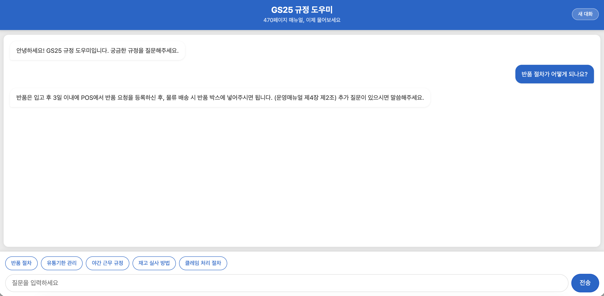

> 💬 **After (#파일 연결 후)의 답변**
>
> "📋 [규정 #12 - 반품/교환]
>
> 반품은 입고 후 72시간 이내에 진행해야 합니다.
> 1. POS에서 반품 전표를 출력합니다
> 2. 상품과 전표를 함께 반품 박스에 넣습니다
> 3. 다음 배송 시 기사님께 전달합니다
>
> ※ 냉장/냉동 상품은 별도 절차가 적용됩니다."
>
> 👉 `regulations.md` 파일의 **실제 데이터**를 기반으로 한 정확한 답변!


### 차이가 느껴지시나요? 🤩

| | ❌ Before (연결 전) | ✅ After (연결 후) |
| --- | --- | --- |
| **답변 근거** | AI의 일반 지식 (추측) | 실제 규정 파일 데이터 |
| **정확도** | 틀릴 수 있음 😟 | 데이터에 있는 내용이라 정확 ✅ |
| **규정 번호** | 없음 | [규정 #12] 처럼 표시됨 |
| **없는 질문** | 그럴듯하게 지어냄 😱 | "등록되지 않았습니다" 라고 솔직하게 안내 |

### 3-3. 추가 테스트 질문들

다른 질문도 해보세요! 데이터에 있는 내용으로 잘 답변하는지 확인합니다.

- "유통기한 관리는 어떻게 하나요?"
- "야간 근무 규정을 알려주세요"
- "재고 실사는 언제 하나요?"

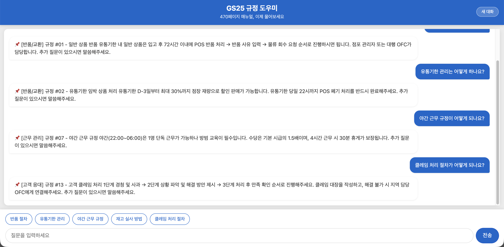

그리고 **데이터에 없는 질문**도 해보세요:

- "본사 전화번호가 뭐예요?"
- "내일 날씨 어때?"

> **👀 확인해보세요!**
> - [ ] 데이터에 있는 질문 → 규정 번호와 함께 정확한 답변이 나온다
> - [ ] 데이터에 없는 질문 → "해당 규정은 등록되지 않았습니다" 라고 안내한다
> - [ ] 답변에 규정 번호가 표시된다 (예: [규정 #12])

> **✅ 축하합니다!**    
> **실제 데이터를 기반으로 답변하는 앱이 완성되었습니다!** 🎉   
>
> 이제 이 앱은:   
> - ❌ AI가 추측해서 답변하지 않습니다
> - ✅ 여러분이 넣은 **진짜 규정 데이터**로 답변합니다
> - ✅ 모르는 건 **모른다고 솔직하게** 말합니다

***

## (참고) 실무에서 #파일 활용 아이디어 💼

지금은 실습용 데이터 1개만 연결했지만, 실무에서는 다양한 파일을 넣을 수 있어요!

| 🏪 활용 상황 | 📂 #파일로 넣을 수 있는 것 |
| --- | --- |
| 규정 검색 도우미 | 운영 매뉴얼, 규정집, FAQ 문서 |
| 사고 대응 보고서 | 보고서 양식 템플릿, 과거 사례 |
| 재계약 어시스턴트 | 공헌이익 분석 자료, 협상 가이드 |
| G-ESPA 활동 코치 | 상권 분석 데이터, 성공/실패 사례 |
| 신입 교육 도우미 | 업무 매뉴얼, 체크리스트, Q&A 모음 |

> **ℹ️ #파일 여러 개도 됩니다!**    
> 파일을 **여러 개 동시에** 참조할 수도 있어요.
>
> 예시:
> ```
> #data/regulations.md #data/faq.md 이 두 파일을 참고해서 답변해줘
> ```
>
> 마치 신입 알바생에게 매뉴얼을 **여러 권** 건네주는 것과 같아요! 📚📚

***

## 🔄 전체 흐름 정리

Module 2에서 우리가 한 일을 전체적으로 정리해볼까요?

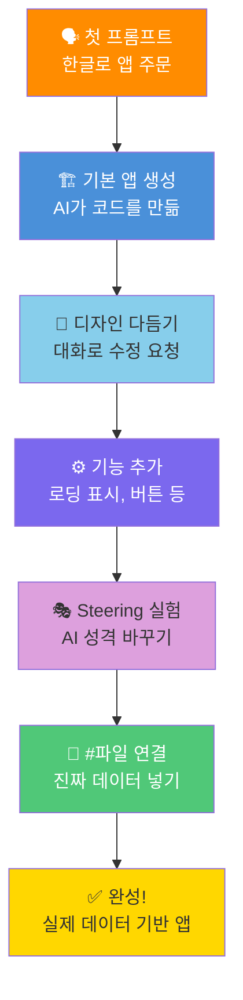

코드를 **한 줄도 쓰지 않고** 여기까지 왔습니다! 대단해요! 🎉

다음 Module에서는 **Spec 기반 개발**로 더 체계적인 앱을 만들어봅니다! 🚀
