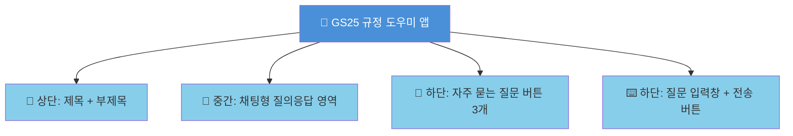
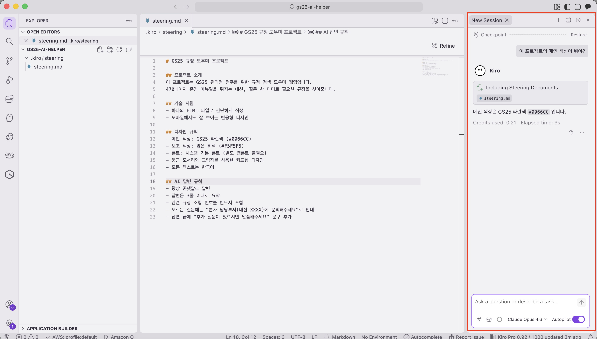
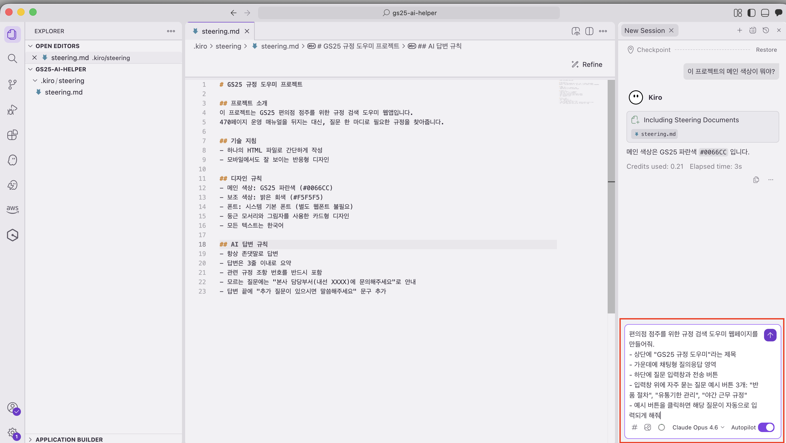
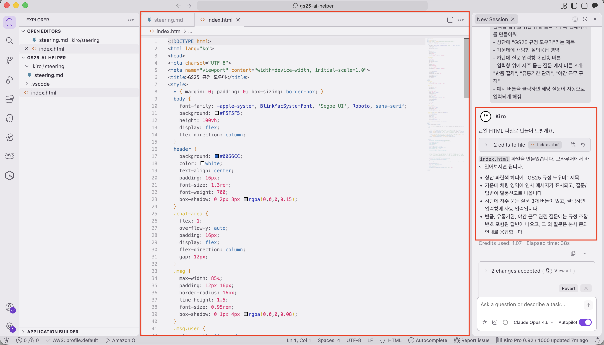
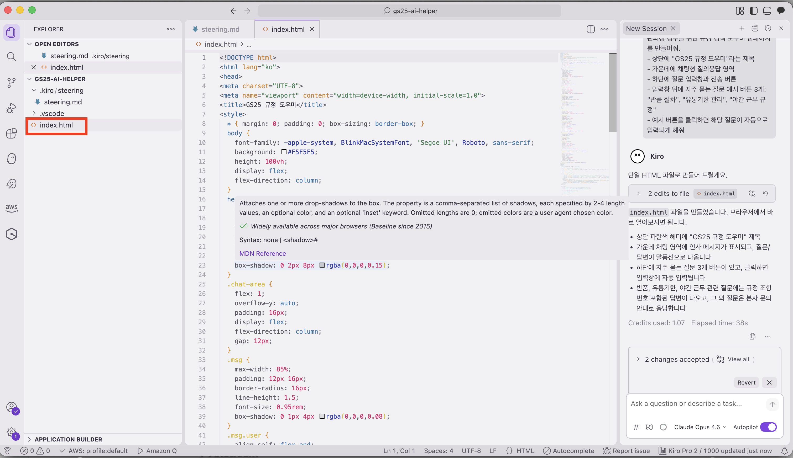
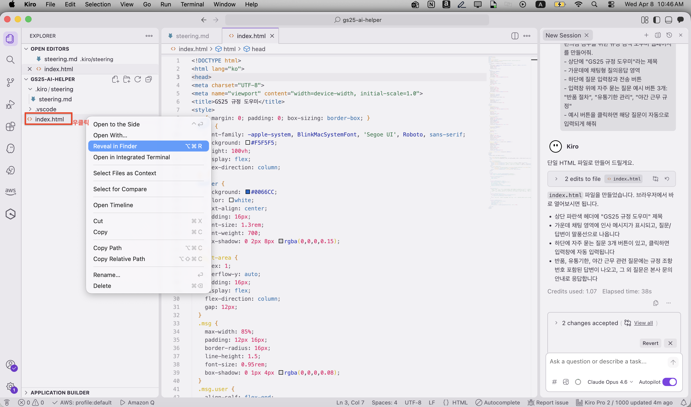
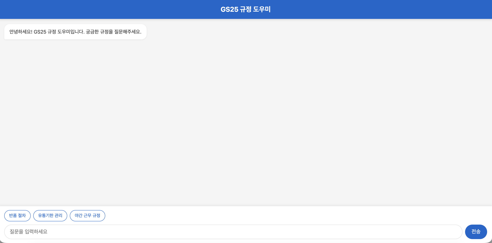
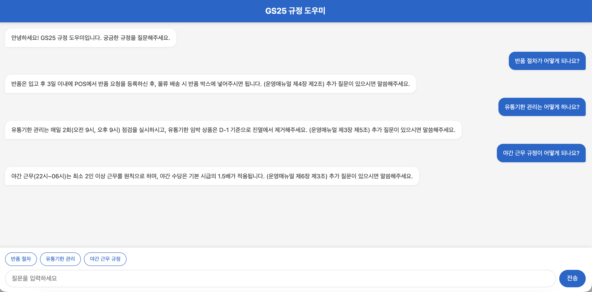

# 첫 번째 프롬프트 🎬

## 드디어! 앱 만들기를 시작합니다!

지금부터 여러분은 **코드를 한 줄도 쓰지 않고** 웹 앱을 만들 것입니다.
믿기 어려우시죠? 직접 해보시면 압니다! 😄

이번 실습에서 만들 것:



***

## Step 1: Kiro Chat 패널 찾기 👀

먼저 화면 오른쪽에 있는 **Kiro Chat** 패널을 찾아주세요.



> **잠깐! 💡**
> Kiro Chat 패널이 안 보이시나요?
> - 화면 오른쪽 상단의 말풍선 버튼을 누르면 다시 Chat 패널을 열 수 있습니다!
> - 정말 안 보이면 진행자에게 손을 들어주세요 🙋

Chat 패널 하단에 **텍스트 입력창**이 보이시나요?  
바로 거기에 한글로 원하는 것을 쓰면 됩니다!

***

## Step 2: 프롬프트 입력하기 ✍️

자, 이제 진짜 시작입니다!
아래 내용을 **그대로 복사**해서 Kiro Chat 입력창에 **붙여넣기** 하세요.

> **ℹ️ 복사하는 방법**
> 1. 아래 회색 박스 안의 텍스트를 **마우스로 전체 선택** (드래그) 합니다
> 2. **Ctrl+C** (Mac은 Cmd+C) 를 눌러 복사합니다
> 3. Kiro Chat 입력창을 **클릭**한 후
> 4. **Ctrl+V** (Mac은 Cmd+V) 를 눌러 붙여넣기 합니다

**📋 아래 내용을 복사해서 Kiro Chat에 붙여넣으세요**

```
편의점 점주를 위한 규정 검색 도우미 웹페이지를 만들어줘.

- 상단에 "GS25 규정 도우미"라는 제목
- 가운데에 채팅형 질의응답 영역
- 하단에 질문 입력창과 전송 버튼
- 입력창 위에 자주 묻는 질문 예시 버튼 3개: "반품 절차", "유통기한 관리", "야간 근무 규정"
- 예시 버튼을 클릭하면 해당 질문이 자동으로 입력되게 해줘
```



붙여넣기가 되었으면 **Enter 키**를 눌러주세요! ⏎

### 🔍 프롬프트의 각 부분이 하는 일

방금 입력한 프롬프트가 어떤 의미인지 궁금하시죠? 하나씩 살펴볼게요.

| 우리가 쓴 문장 | 어떤 역할을 하나요? |
| --- | --- |
| "편의점 점주를 위한 규정 검색 도우미 웹페이지를 만들어줘" | 🎯 **무엇을** 만들지 알려줌 — 카페에서 "아메리카노 주세요"와 같습니다 |
| "상단에 GS25 규정 도우미라는 제목" | 📐 **화면 구성**을 지정 — "컵에 이름 써주세요"와 같습니다 |
| "채팅형 질의응답 영역" | ⚙️ **핵심 기능**을 설명 — "얼음 많이요"와 같습니다 |
| "자주 묻는 질문 예시 버튼 3개" | 🎁 **편의 기능** 추가 — "슬리브도 씌워주세요"와 같습니다 |
| "클릭하면 자동으로 입력되게" | 🔄 **동작 방식** 지정 — "빨대도 꽂아주세요"와 같습니다 |

> **잠깐! 💡 프롬프트 잘 쓰는 비결**  
> 프롬프트는 **구체적일수록 좋습니다.**
> - ❌ "웹페이지 만들어줘" → 너무 막연해서 AI가 아무거나 만들 수 있어요
> - ✅ "채팅형 질의응답 영역이 있는 편의점 규정 검색 웹페이지 만들어줘" → 훨씬 정확!
>
> 마치 식당에서 "맛있는 거 주세요" 보다 **"김치찌개 1인분이요"** 가 정확한 것과 같아요! 🍲

***

## Step 3: AI가 코드를 만드는 과정 지켜보기 👀

Enter를 누르면... 🥁 **마법이 시작됩니다!**

Kiro가 코드를 만들기 시작합니다. 화면의 여러 곳에서 변화가 일어나요.

### 화면에서 이런 것들이 보입니다



**1️⃣ 채팅창 (오른쪽)**
AI가 "이렇게 만들겠습니다" 하고 자기 계획을 설명합니다.
마치 요리사가 "지금부터 김치찌개를 끓이겠습니다~" 하는 것과 같아요 👨‍🍳

**2️⃣ 코드 영역 (가운데)**
코드가 **자동으로 타이핑**되는 것이 보입니다!
글자가 쫘르르르~ 빠르게 써지는 게 보이면 정상입니다 ✅

**3️⃣ 파일 탐색기 (왼쪽)**
새로운 파일이 생겨납니다. `index.html` 같은 파일이 보일 거예요.


> **⚠️ 중요: 기다려주세요!**   
> 코드가 만들어지는 동안 **1~2분 정도** 걸릴 수 있습니다.   
> 이 시간 동안 **절대 다른 것을 누르거나 입력하지 마세요!**
>
> ⏳ 코드 영역에서 글자가 빠르게 쓰여지고 있으면 = **정상**, 기다리세요!     
> ⏳ 채팅창에 AI가 말을 하고 있으면 = **정상**, 기다리세요!    
> ✅ AI가 더 이상 말하지 않고, 코드 작성이 멈추면 = **완료!** 다음 단계로!      

***

## Step 4: 결과 확인하기 — 브라우저에서 내 앱 보기! 🌐

AI가 코드를 다 만들었으면, 이제 **내가 만든(!) 앱을 브라우저에서 직접 확인**합니다!

### 4-1. index.html 파일 찾기

화면 **왼쪽**의 파일 탐색기에서 `index.html` 파일을 찾아주세요.



> **잠깐! 💡**
> `index.html`이 안 보이시나요?
> - 폴더 안에 들어있을 수 있습니다. 폴더 이름 왼쪽의 ▶ 화살표를 클릭해서 열어보세요
> - 정말 안 보이면 AI가 아직 만드는 중일 수 있어요. 조금 더 기다려보세요 ⏳

### 4-2. 브라우저에서 열기

`index.html` 파일을 찾으셨으면:

1. `index.html` 파일을 **마우스 오른쪽 버튼**으로 클릭합니다
2. 메뉴가 뜨면 **Reveal in Finder** 또는 **탐색기에서 열기** 를 찾아서 클릭합니다




### 4-3. 브라우저 확인

Finder 또는 탐색기 창이 열리고 `index.html` 파일이 보이신다면 **더블클릭** 해주세요!   
잠시 후 **브라우저(인터넷 창)가 자동으로 열리면서** 앱이 나타납니다! 🚀




### 👀 확인해보세요!

화면에 이런 것들이 보이나요? 하나씩 체크해보세요 ✅

- [ ] 📌 상단에 "GS25 규정 도우미" 제목이 보인다
- [ ] 💬 가운데에 채팅 영역이 있다
- [ ] 🔘 "반품 절차", "유통기한 관리", "야간 근무 규정" 버튼이 보인다
- [ ] ⌨️ 하단에 질문 입력창과 전송 버튼이 있다
- [ ] 👆 예시 버튼을 클릭하면 입력창에 텍스트가 자동으로 들어간다

버튼을 누르거나 채팅을 입력해서 자유롭게 테스트 해보세요!  



***

## 🎉🎉🎉 축하합니다! 🎉🎉🎉

### 여러분은 방금 코드를 한 줄도 쓰지 않고 웹 앱을 만들었습니다!

잠시 이 사실을 음미해보세요... ☕

- 🔤 코드를 몰라도 됩니다
- 🇰🇷 한글로만 말했습니다
- ⏱️ 몇 분밖에 안 걸렸습니다
- 🌐 진짜 브라우저에서 돌아가는 앱입니다

**이것이 바이브 코딩의 힘입니다!** 🚀

> **ℹ️ 참고**
> 물론 아직 완벽하진 않을 수 있어요.  
> 디자인이 좀 투박하거나, 원하는 것과 다른 부분이 있을 수 있습니다.   
> **그래서 다음 시간에 "대화로 다듬기"를 합니다!**   
> 바이브 코딩은 한 번에 완벽하게 만드는 게 아니라, **대화하면서 점점 좋게** 만드는 과정이에요.   😊

***

## 🆘 잘 안 되는 경우 (트러블슈팅)

당황하지 마세요! 아래에서 해당하는 상황을 찾아보세요. 🔍

<details>
<summary>😰 브라우저에 아무것도 안 보여요</summary>

**차근차근 확인해보세요:**

1. **파일이 만들어졌나요?**
   - 왼쪽 파일 탐색기에서 `index.html` 파일이 있는지 확인하세요
   - 없으면 → AI가 아직 만드는 중이거나, 다른 이름으로 만들었을 수 있어요

2. 계속 파일이 안 보이면 → **진행자에게 문의해주세요** 🙋

</details>

<details>
<summary>😰 코드 생성이 중간에 멈췄어요</summary>

**가끔 이런 일이 있어요. 당황하지 마세요!**

1. Kiro Chat 입력창에 이렇게 입력하세요:

```
계속해줘
```

2. 또는 이렇게 입력하세요:

```
이어서 만들어줘
```

3. 그래도 안 되면 → 새로운 대화를 시작하고 처음 프롬프트를 다시 입력해보세요
4. 그래도 안 되면 → **진행자에게 문의해주세요** 🙋

</details>

<details>
<summary>😰 앱이 내가 상상한 것과 많이 달라요</summary>

**괜찮습니다! 이건 정상이에요. 😊**

- 바이브 코딩은 **한 번에 완벽하게** 만드는 방식이 아닙니다
- 다음 실습 "대화로 다듬기"에서 디자인과 기능을 **대화를 통해 수정**할 수 있어요
- 지금은 기본 틀만 나왔으면 **성공**입니다!

만약 아예 엉뚱한 것이 나왔다면 (예: 규정 도우미가 아닌 전혀 다른 앱):
- Kiro Chat에 "아니, 편의점 규정 검색 도우미를 만들어달라고 했어. 다시 만들어줘" 라고 요청해보세요

</details>

<details>
<summary>😰 Steering에 적은 디자인이 적용 안 된 것 같아요</summary>

**확인할 것:**

1. **Steering 파일이 저장되었나요?**
   - `.kiro/steering.md` 파일을 열어보세요
   - Module 1에서 작성한 내용이 있는지 확인하세요
   - `Ctrl+S` (Mac은 `Cmd+S`)를 눌러 한번 더 저장해보세요

2. **AI에게 다시 알려주세요:**
   Kiro Chat에 이렇게 입력하세요:

```
steering.md에 적은 디자인 규칙을 반영해서 앱을 다시 만들어줘
```

</details>

<details>
<summary>😰 영어로 된 에러 메시지가 나와요</summary>

**당황하지 마세요! 에러 메시지는 AI한테 맡기면 됩니다.**

1. 에러 메시지를 **그대로 복사** (Ctrl+C) 합니다
2. Kiro Chat에 **붙여넣기** (Ctrl+V) 하고 이렇게 말하세요:

```
이 에러가 나는데 고쳐줘
```

3. AI가 알아서 에러를 분석하고 수정해줍니다!

</details>

***

모든 문제가 해결되었나요? 다음 페이지에서 **대화로 앱을 더 멋지게 다듬어봅시다!** 🎨
