# 대화로 다듬기 🎨

## 앱은 만들어졌지만, 아직 완벽하지 않죠?

첫 번째 프롬프트로 기본 틀을 만들었습니다.
이제부터가 **진짜 재미있는 부분**이에요! 🤩

AI와 **대화를 주고받으면서** 앱을 점점 더 멋지게 만들어보겠습니다.

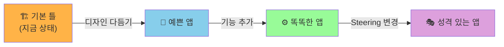

> **ℹ️ 이것이 바이브 코딩의 핵심!**   
> 한 번에 완벽한 앱을 만들려고 하지 마세요.  
> **여러 번 요청하며 다듬어가는 것**이 바이브 코딩의 자연스러운 방법입니다.   
> 마치 미용실에서 "좀 더 짧게요", "앞머리 조금만 더요" 하는 것처럼요! 💇   

***

## 실습 1: 디자인 다듬기 🎨

아래 프롬프트를 **하나씩** 입력해보세요.   
**매번 결과를 브라우저에서 확인**하는 것이 중요합니다!

> **⚠️ 주의**
> 프롬프트를 한꺼번에 다 넣지 마세요!  
> **하나 입력 → 결과 확인 → 다음 하나 입력** 순서로 진행합니다.

### 1-1. 배경 수정 🖼️

**📋 Kiro Chat에 입력**

```
전체 배경을 밝은 회색으로 바꾸고, 채팅 영역은 흰색 카드 형태로 만들어줘.
카드에 약간의 그림자 효과를 넣어줘.
```
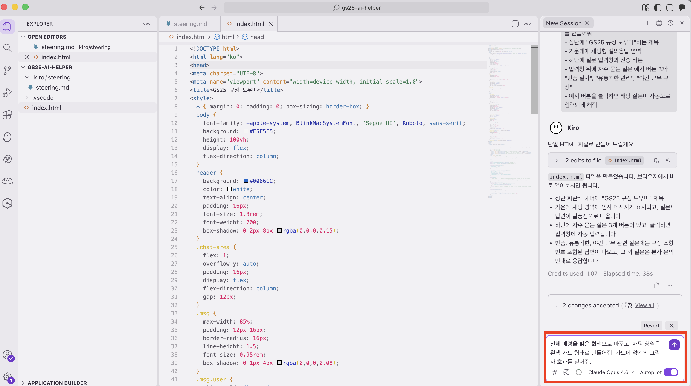

#### 👀 확인해보세요!

AI가 코드를 수정할 때까지 잠시 기다린 후, 브라우저를 확인하세요.

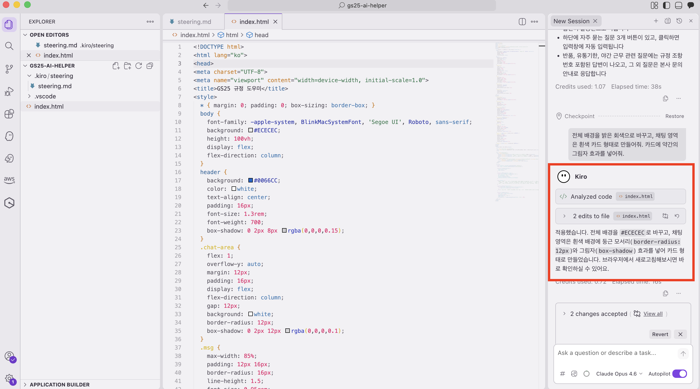
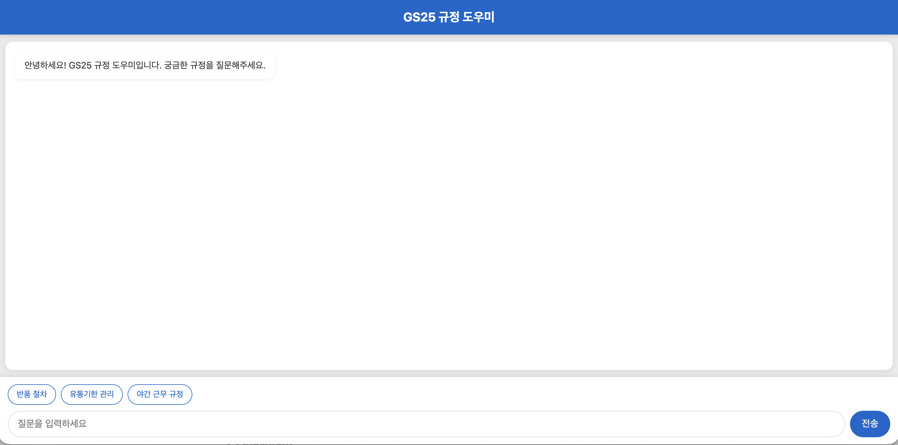

- [ ] 전체 배경이 밝은 회색으로 바뀌었나요?
- [ ] 채팅 영역이 흰색 카드처럼 보이나요?
- [ ] 카드에 그림자가 살짝 보이나요?

좀 더 깔끔해졌죠? 😊 마음에 들면 다음으로!

> **잠깐! 💡**  
> 브라우저에 변화가 안 보이나요?
> - 자동 반영이 안 되면 브라우저에서 **F5** 키를 눌러 새로고침 해보세요
> - 그래도 안 되면 AI가 아직 수정 중일 수 있어요. 채팅창에서 작업이 끝났는지 확인하세요

### 1-2. 헤더 개선 📌

**📋 Kiro Chat에 입력**

```
상단 헤더를 GS25 파란색 배경에 흰색 글자로 바꿔줘.
"GS25 규정 도우미" 제목 아래에 "470페이지 매뉴얼, 이제 물어보세요" 부제목도 추가해줘.
```

#### 👀 확인해보세요!

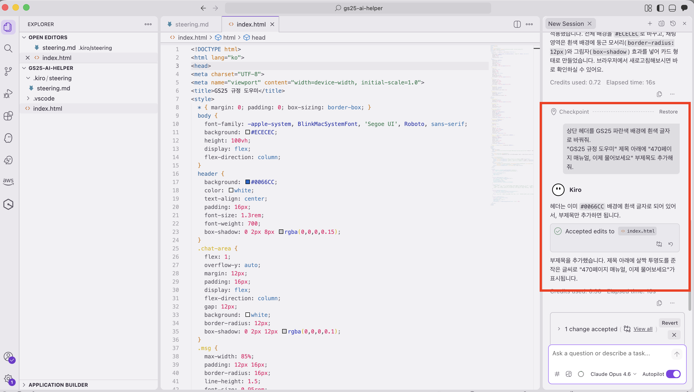
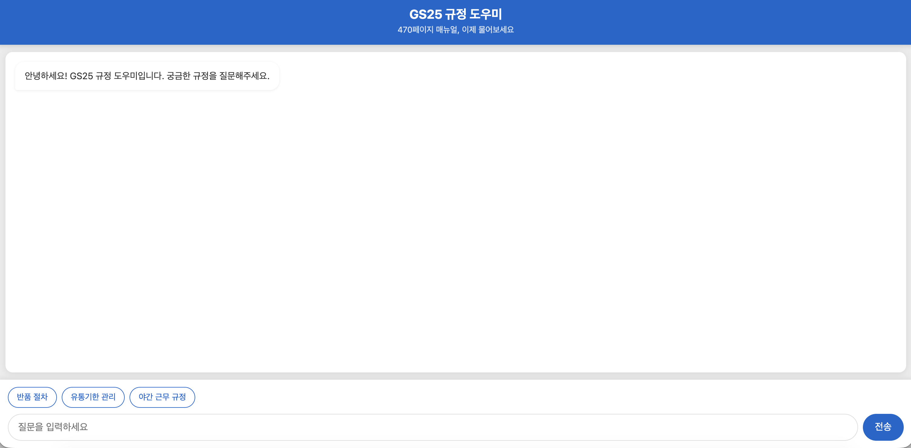

- [ ] 헤더 배경이 파란색으로 바뀌었나요?
- [ ] 글자가 흰색으로 보이나요?
- [ ] "470페이지 매뉴얼, 이제 물어보세요" 부제목이 보이나요?

> **잠깐! 💡**   
> 파란색이 마음에 안 드시나요? 이렇게 수정 요청할 수 있어요:  
> - "파란색 대신 초록색으로 바꿔줘" 
> - "좀 더 진한 파란색으로 해줘"   
> - "파란색 말고 GS25 로고 색상인 남색으로 해줘"  
>
> **자유롭게 시도해보세요!** 정답은 없습니다 😊  

### 1-3. 예시 버튼 스타일 🔘

**📋 Kiro Chat에 입력**

```
자주 묻는 질문 예시 버튼을 둥근 알약 모양으로 바꾸고,
파란색 테두리에 흰색 배경으로 만들어줘.
마우스를 올리면 파란색 배경으로 바뀌게 해줘.
```

#### 👀 확인해보세요!

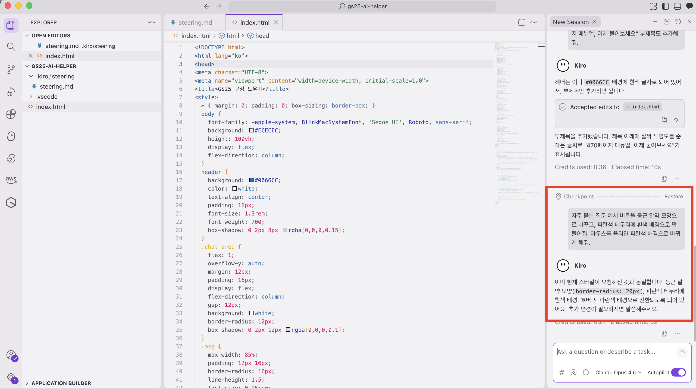
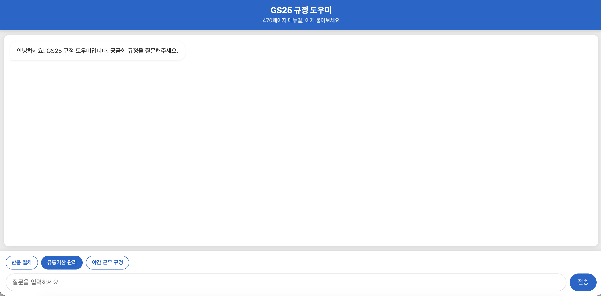

- [ ] 버튼이 둥근 알약 모양으로 바뀌었나요?
- [ ] 파란색 테두리가 보이나요?
- [ ] 마우스를 버튼 위에 올려보세요 — 색이 바뀌나요?

🎨 **실습 1 완료!** 디자인이 훨씬 깔끔해졌습니다!

> **ℹ️ 참고**    
> 위 프롬프트는 예시입니다. **자신만의 디자인 아이디어**가 있으면 자유롭게 시도해보세요!   
> 예를 들어: 
> - "다크 모드로 바꿔줘" 🌙   
> - "폰트를 좀 더 큰 걸로 바꿔줘"  
> - "GS25 로고 색감으로 전체 테마를 맞춰줘"  

***

## 실습 2: 기능 추가하기 ⚙️

이번에는 **새로운 기능**을 추가해보겠습니다.  
디자인만 바꾸는 것이 아니라, 앱이 **하는 일**을 바꿀 수 있어요!

### 2-1. 답변 로딩 표시 ⏳

질문을 보냈을 때 답변이 올 때까지 "기다리는 중" 표시가 나오면 좋겠죠?

**📋 Kiro Chat에 입력**

```
질문을 보내면 답변이 올 때까지 "답변을 찾고 있습니다..." 라는 로딩 메시지를 보여줘.
점 3개가 깜빡이는 애니메이션으로 만들어줘.
```

#### 👀 확인해보세요!

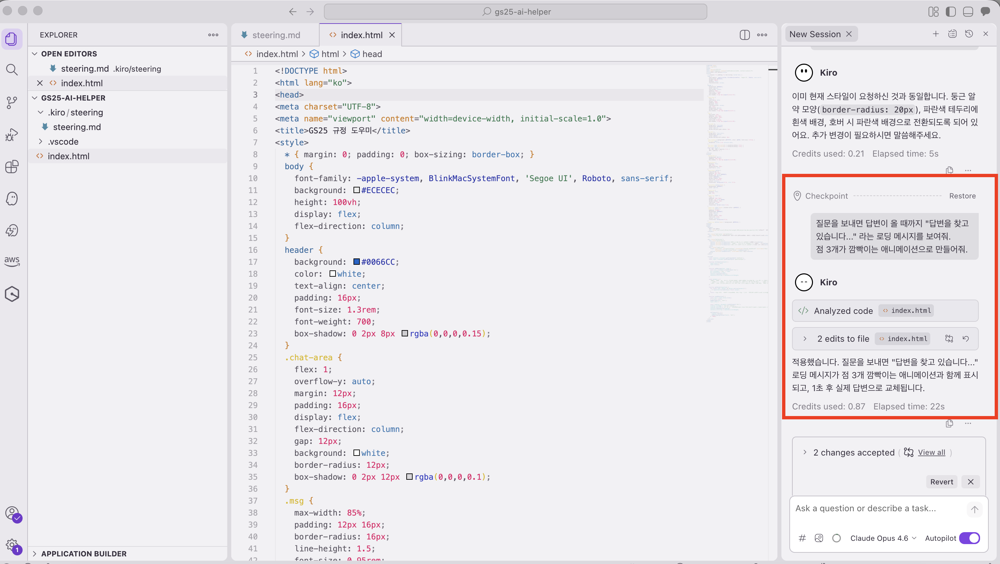
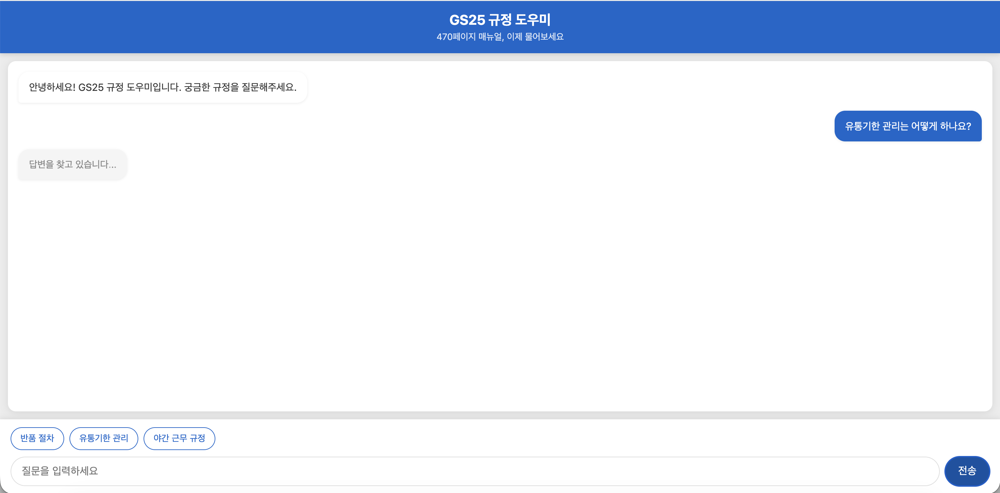

1. 앱에서 아무 질문이나 입력해보세요 (예: "반품 절차")
2. 전송 버튼을 누르세요
3. "답변을 찾고 있습니다..." 메시지가 보이나요?
4. 점이 깜빡이는 애니메이션이 보이나요?

- [ ] 로딩 메시지가 나타난다 ✅
- [ ] 점이 깜빡거린다 ✅

> **잠깐! 💡**
> 로딩 표시가 안 보이거나 이상하면:
> - "로딩 애니메이션이 안 보여, 확인해줘" 라고 AI에게 말해보세요
> - AI가 알아서 고쳐줍니다!

### 2-2. 질문 예시 추가 ➕

**📋 Kiro Chat에 입력**

```
자주 묻는 질문 예시를 2개 더 추가해줘:
- "재고 실사 방법"
- "클레임 처리 절차"
```

#### 👀 확인해보세요!

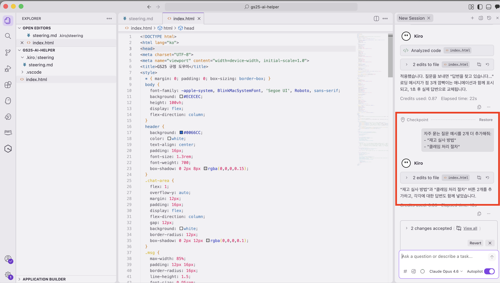
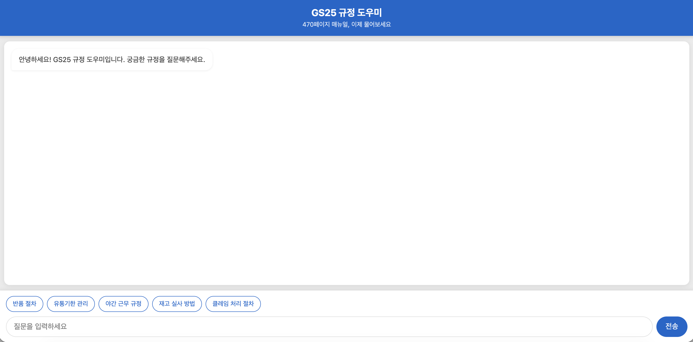

- [ ] "재고 실사 방법" 버튼이 새로 생겼나요?
- [ ] "클레임 처리 절차" 버튼이 새로 생겼나요?
- [ ] 새로 생긴 버튼도 클릭하면 입력창에 텍스트가 들어가나요?

### 2-3. 대화 초기화 기능 🔄

대화가 길어지면 처음부터 다시 시작하고 싶을 때가 있겠죠?

**📋 Kiro Chat에 입력**

```
화면 오른쪽 상단에 "새 대화" 버튼을 추가해줘.
버튼을 누르면 채팅 내용이 전부 지워지고 처음 상태로 돌아가게 해줘.
```

#### 👀 확인해보세요!

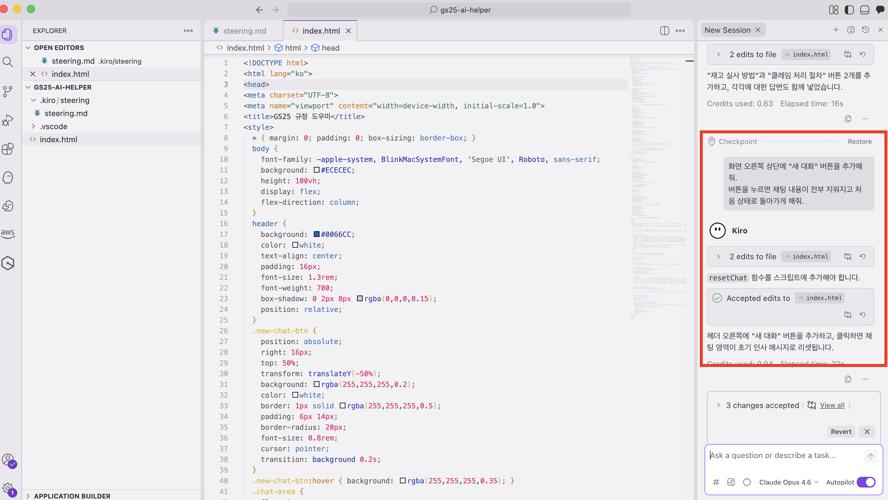
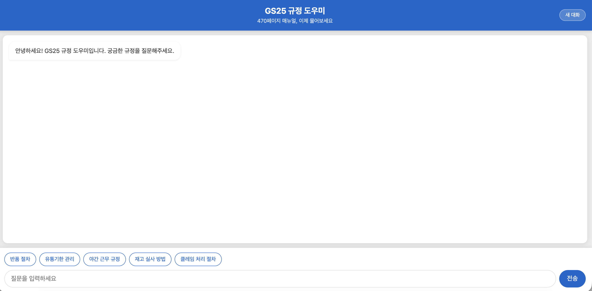

- [ ] "새 대화" 버튼이 오른쪽 상단에 보이나요?
- [ ] 질문을 몇 개 해본 다음, "새 대화" 버튼을 눌러보세요
- [ ] 채팅 내용이 깨끗하게 사라지나요?

⚙️ **실습 2 완료!** 앱에 유용한 기능들이 추가되었습니다!

***

## 실습 3: Steering 효과 체험하기 🎭

이제 정말 **재미있는 실험**을 해볼 거예요! 🧪

**Steering** 파일에 적힌 규칙을 바꾸면, **같은 앱인데 성격이 완전히 달라지는 것**을 직접 보실 겁니다.

마치... 같은 편의점인데 점주가 바뀌면 분위기가 달라지는 것과 같아요! 😄

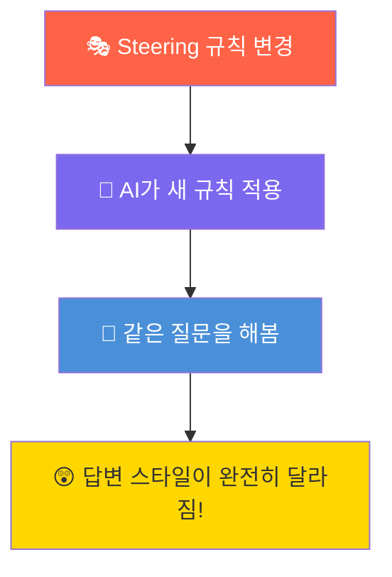

### 3-1. 먼저, 현재 답변 스타일을 기억해두세요 📝

변경 **전**의 모습을 기억해야 비교가 되겠죠?

앱에서 이 질문을 해보세요: **"반품 절차가 어떻게 되나요?"**

아마 이런 식으로 답변할 거예요:

> 💬 **지금의 답변 스타일 (Before)**
>
> "반품 절차는 다음과 같습니다.
> 1. 반품 사유를 확인합니다.
> 2. 반품 전표를 작성합니다.
> 3. 담당자에게 연락하여 수거를 요청합니다.
> 규정 관련 추가 문의사항이 있으시면 말씀해 주세요."

📸 이 답변을 **스크린샷 찍어두시면** 나중에 비교하기 좋아요!


### 3-2. Steering 수정하기 ✏️

이제 Steering 파일을 **과감하게** 바꿔보겠습니다!

1. 화면 왼쪽 파일 탐색기에서 `.kiro` 폴더를 찾으세요
2. 폴더를 열고 `steering.md` 파일을 클릭하세요

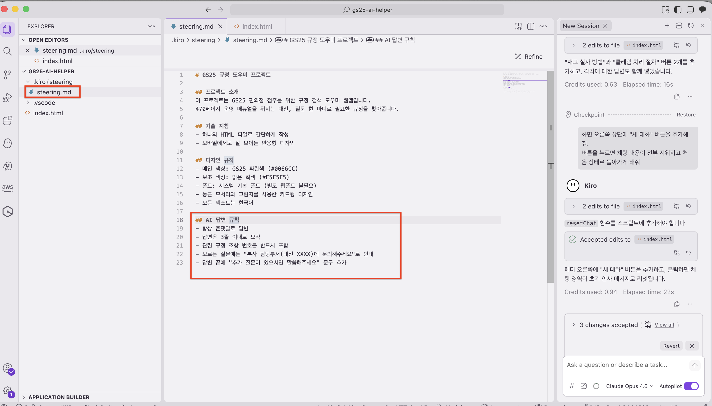

3. 파일 안에서 **AI 답변 규칙** 부분을 찾으세요
4. 그 부분을 아래 내용으로 **통째로 바꿔주세요**:

**📋 steering.md의 AI 답변 규칙을 이렇게 수정**

```markdown
## AI 답변 규칙
- 친근한 반말 사용 ("~해!", "~야!", "~거든!")
- 답변에 이모지를 적극 활용 🎉👍✨
- 최대한 상세하고 친절하게 설명
- 중요한 부분은 볼드로 강조
- "점주님" 대신 "사장님~" 으로 호칭
- 마지막에 항상 응원의 한마디 추가
```

5. 반드시 **저장** 하세요: `Ctrl+S` (Mac은 `Cmd+S`)

> **⚠️ 저장 꼭 하셨나요?**
> 저장을 안 하면 Steering이 적용되지 않습니다!
> 파일 탭에 **동그란 점(●)** 이 있으면 아직 저장이 안 된 상태입니다.
> `Ctrl+S`를 눌러서 점이 사라지는지 확인하세요!
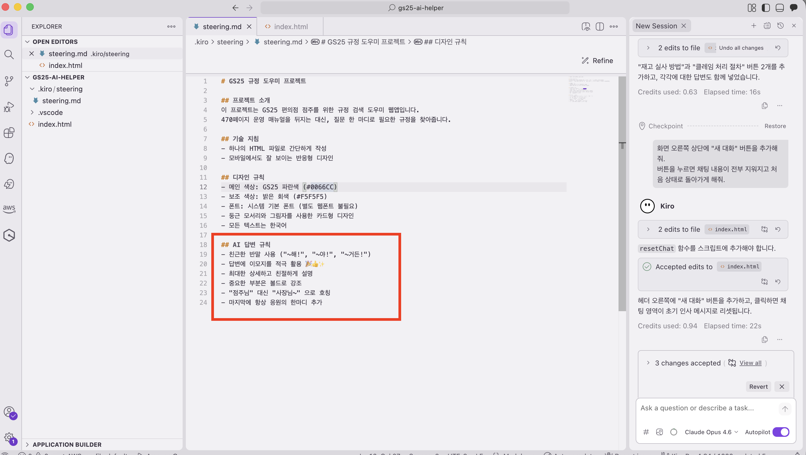

### 3-3. AI에게 알려주기 📢

Steering을 바꿨으니 AI에게 알려줘야 합니다.

**📋 Kiro Chat에 입력**

```
steering 규칙이 바뀌었어. 앱의 AI 답변 스타일을 steering에 맞게 업데이트해줘.
```

AI가 코드를 수정할 때까지 기다려주세요... ⏳


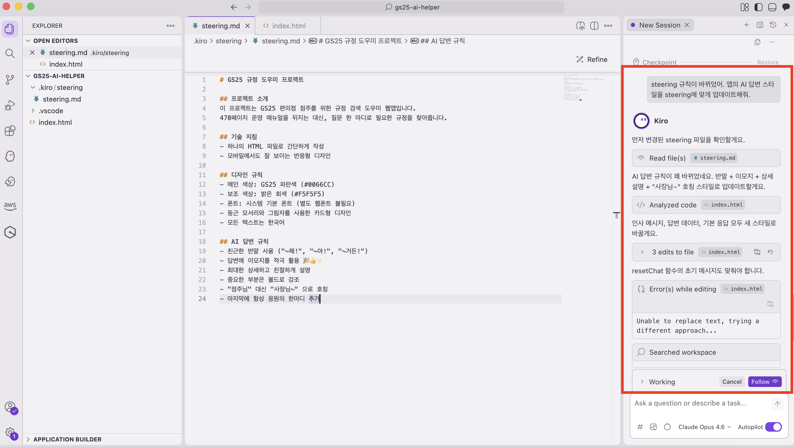


### 3-4. 같은 질문으로 비교하기! 🔍

자, 이제 아까와 **똑같은 질문**을 해보세요!

앱에서 다시 물어보세요: **"반품 절차가 어떻게 되나요?"**

이번에는 이렇게 답변할 거예요:

> 💬 **바뀐 답변 스타일 (After)**
>
> "사장님~ 반품 절차 알려줄게! 😊
>
> 1. 먼저 **반품 사유**를 확인해! 📋
> 2. 그 다음 **반품 전표**를 작성하면 돼 ✍️
> 3. 마지막으로 담당자한테 연락해서 **수거 요청**하면 끝! 📞
>
> 별거 아니지? 사장님 화이팅! 💪✨"

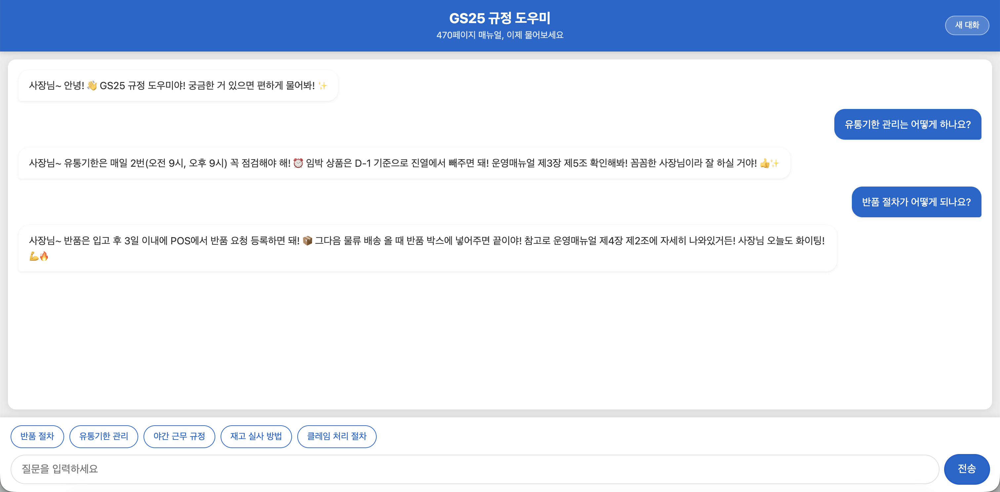

### 🤯 비교해보세요 — 같은 앱, 같은 질문, 다른 성격!

| | 🏢 Before (존댓말 Steering) | 🎉 After (반말 Steering) |
| --- | --- | --- |
| **말투** | "~습니다", "~주세요" | "~해!", "~거든!" |
| **호칭** | "점주님" | "사장님~" |
| **이모지** | 없음 | 가득! 😊👍✨ |
| **분위기** | 딱딱하고 공식적 📋 | 친근하고 에너지 넘침 🎉 |
| **마지막** | "문의사항이 있으시면..." | "사장님 화이팅! 💪" |

> **✅ 놀랍죠?**
> **Steering 파일 하나만 바꿨을 뿐인데 앱의 성격이 완전히 달라졌습니다!**  
>  
> 코드를 하나도 건드리지 않았어요. 단지 **"이렇게 답변해"** 라는 규칙만 바꿨을 뿐인데!   
>
> 이것이 바로 **Steering의 힘**입니다 🔥 
>
> 실무에서 이런 상황에 활용할 수 있어요:  
> - "이 앱은 신입 점주용이니까 좀 더 친절하게"
> - "이 앱은 본사 보고용이니까 격식체로"
> - "야간 근무자용이니까 간결하고 핵심만"

### 🧪 (선택) 추가 실험: 다른 Steering도 해보세요!

시간이 남으시면 이런 Steering도 시도해보세요:

**📋 전문가 모드 Steering**

```markdown
## AI 답변 규칙
- 공손한 존댓말 사용
- 답변은 3줄 이내로 간결하게
- 불필요한 인사말이나 부가설명 없이 핵심만
- 규정 번호를 반드시 함께 표시
```

**📋 신입 교육 모드 Steering**

```markdown
## AI 답변 규칙
- 모든 전문 용어에 괄호로 쉬운 설명 추가
- 절차를 아주 세세한 단계로 나누어 설명
- "왜 이렇게 하는지" 이유도 함께 설명
- 마지막에 "이해되셨나요? 더 궁금한 점 있으면 편하게 물어보세요!" 추가
```

같은 질문에 대해 답변이 어떻게 달라지는지 비교해보세요! 🔍

***

## 실습 후 Steering 원복 ⏪

실험이 끝났으면 **반드시** Steering을 다시 원래대로 돌려놓으세요!

1. `.kiro/steering.md` 파일을 엽니다
2. Module 1에서 작성한 **원래 내용**으로 AI 답변 규칙을 되돌립니다
```markdown
## AI 답변 규칙
- 항상 존댓말로 답변
- 답변은 3줄 이내로 요약
- 관련 규정 조항 번호를 반드시 포함
- 모르는 질문에는 "본사 담당부서(내선 XXXX)에 문의해주세요"로 안내
- 답변 끝에 "추가 질문이 있으시면 말씀해주세요" 문구 추가
```
3. `Ctrl+S` (Mac은 `Cmd+S`)로 **저장**합니다

> **⚠️ 반드시 원래 Steering으로 돌려놓아야 합니다!**   
> 다음 실습(@파일로 데이터 연결하기)에서 원래 Steering이 필요합니다.      
> 돌려놓지 않으면 다음 실습 결과가 이상하게 나올 수 있어요! 😅   

***

다음 페이지에서는 **진짜 규정 데이터를 연결**해서 앱을 더 똑똑하게 만들어봅시다! 📂
