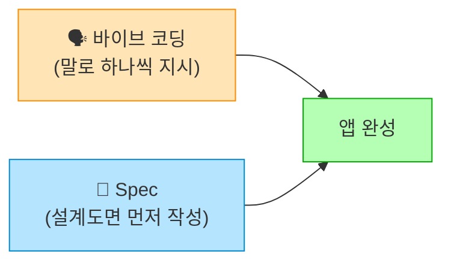
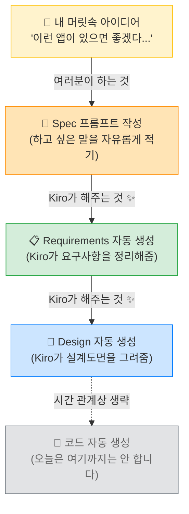

# Module 3: Spec - 요구사항 정리하기 📋

## 🎯 이번 Module에서 할 것

| 순서 | 내용 | 시간 |
| --- | --- | --- |
| 1 | Spec의 개념 이해하기 💡 | 5분 |
| 2 | Spec 작성해보기 ✍️ | 10분 |

> **ℹ️ 안심하세요!**
> 이번 Module은 **15분짜리 맛보기**입니다. Spec의 핵심 개념만 가볍게 체험해볼 거예요.
> 어려운 건 전혀 없습니다 — 여러분은 그냥 **하고 싶은 말을 적기만** 하면 됩니다! 😊

***

## 🏠 인테리어 설계도면, 기억나시나요?

편의점 리모델링을 할 때를 떠올려보세요.

**방법 A: 말로만 지시하기** 🗣️

> "진열대 저기로 옮기고요... 아 근데 카운터도 좀 바꿔야 하는데...\
> 아참, 냉장고 위치도 바꿔야 해요. 아까 말한 진열대 크기는... 뭐라고 했더라?"

인테리어 업자도 헷갈리고, 나도 헷갈립니다. 😵

**방법 B: 설계도면 먼저 그리기** 📐

> 도면 한 장에 전체 배치가 다 그려져 있으니까,\
> 업자도 한눈에 파악하고, 나중에 "이거 아니었는데..." 하는 일도 없습니다.

**Module 2의 바이브 코딩**은 방법 A였습니다 — 말로 하나씩 지시하는 거죠.

**Module 3의 Spec**은 방법 B입니다 — **설계도면을 먼저 그리는 것**이에요!

> **⚠️ 잠깐!**
> "설계도면을 내가 직접 그려야 하는 건가요?!" 😰 걱정 마세요!\
> 여러분은 **"이런 공간이 필요해요"라고 말만 하면** 됩니다.\
> **Kiro가 전문 설계사처럼 도면을 자동으로 그려줍니다!** ✨

***

## 🤔 바이브 코딩만으로 충분하지 않을 때

Module 2에서 바이브 코딩으로 앱을 만들어봤죠? 잘 되었습니다! 👏

그런데 만들 앱이 좀 더 복잡해지면 이런 문제가 생깁니다:

| 상황 | 문제 | 편의점 비유 |
| --- | --- | --- |
| 기능이 10개 이상 🔧 | 채팅으로 하나씩 요청하면 앞에 만든 것이 깨질 수 있음 | 진열대 옮겼더니 냉장고 문이 안 열림 🚪 |
| 여러 명이 함께 작업 👥 | "뭘 만들지" 합의 없이 진행하면 혼란 | 인테리어 업자 두 명이 각각 다른 도면으로 공사 시작 🔨 |
| 나중에 수정할 때 📝 | 처음 요구사항이 뭐였는지 기억이 안 남 | "카운터를 왜 여기에 뒀더라...?" 🤷 |

이럴 때 **Spec**을 먼저 작성하면, AI가 **전체 그림을 보고** 체계적으로 만들어줍니다.

***

## 📊 Spec은 이런 흐름으로 진행됩니다

여러분의 아이디어가 설계도가 되는 과정을 그림으로 보면:

> **✅ 핵심 포인트**
> 위 그림에서 여러분이 직접 하는 것은 **딱 하나** — 아이디어를 적는 것뿐입니다! 🎉\
> 나머지는 전부 Kiro가 해줍니다.

***

## ⚖️ 바이브 코딩 vs Spec, 언제 뭘 쓸까?

| | 🗣️ 바이브 코딩 | 📐 Spec |
| --- | --- | --- |
| **적합한 경우** | 간단한 앱, 빠른 프로토타입 | 기능이 많은 앱, 큰 프로젝트 |
| **장점** | 빠르고 직관적 | 체계적이고 빠뜨리는 것 없음 |
| **단점** | 복잡해지면 앞뒤가 안 맞을 수 있음 | 초기에 정리하는 시간 필요 |
| **편의점 비유** | 인테리어 업자에게 말로 지시 | 설계도면을 먼저 주고 시작 |
| **오늘 기준** | Module 2에서 했던 것 | **👉 지금 할 것!** |

> **ℹ️ 참고**
> 실제로는 두 방식을 **섞어 쓰는 것**이 가장 좋습니다!\
> Spec으로 큰 틀을 잡고 → 세부 조정은 바이브 코딩으로 ✨

***

> **✅ 오늘의 범위**
> 오늘 워크샵에서는 Spec의 **"요구사항 정리 → AI가 설계도 생성"** 단계까지만 체험합니다.\
> 15분이면 충분합니다! Spec에서 코드를 자동 생성하는 것은 시간 관계상 생략하지만,\
> 이 과정만 경험해도 **"아, 이렇게 정리하면 AI가 더 잘 이해하는구나!"** 하는 감을 잡으실 수 있습니다 💪

자, 이제 직접 해볼까요? 다음 페이지로 넘어가세요! ➡️
