# 🚀 (보너스) Task 실행하기 — 설계도대로 앱 만들기!

> **ℹ️ 이 페이지는 보너스 실습입니다**       
> 시간이 남거나, "Spec으로 끝까지 해보고 싶다!" 하시는 분만 도전해보세요! 💪     
> Task 실행은 **시간이 좀 걸릴 수 있어서** (5~10분), 워크샵 중에는 건너뛰어도 괜찮습니다.   
> 나중에 혼자 연습할 때 해보셔도 좋아요!

***

## 🤔 Task가 뭔가요?

앞에서 여러분은 이렇게 진행했습니다:

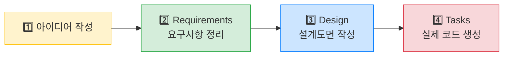

| 단계 | 편의점 비유 | 설명 |
| --- | --- | --- |
| 1️⃣ 아이디어 | "이런 가게 만들고 싶어" | ✅ 했음! |
| 2️⃣ Requirements | 시공 요구사항 정리 | ✅ 했음! |
| 3️⃣ Design | 설계도면 | ✅ 했음! |
| 4️⃣ **Tasks** | **실제 공사 시작!** 🏗️ | 👈 **지금 할 것!** |

**Task = 설계도면을 보고 실제로 공사(코드 생성)를 하는 단계**입니다.

Kiro가 Design 문서를 보고, 해야 할 일을 **체크리스트**로 쪼개줍니다.\
그리고 하나씩 체크하면서 코드를 자동으로 만들어요!

***

## 📋 Step 1: Task 목록 확인하기

Design 문서 생성이 끝난 뒤, `→ Continue` 버튼을 눌러 `Generate Tasks` 버튼을 눌러봅니다.   
Kiro가 자동으로 **Tasks(할 일 목록)**을 만들어줍니다.
> 이 또한 채팅 창에 `태스크 목록을 만들어줘` 라고 타이핑하면 같은 효과가 납니다!

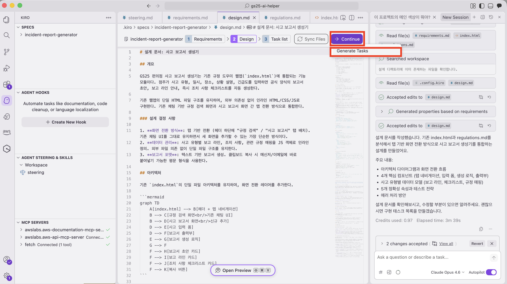

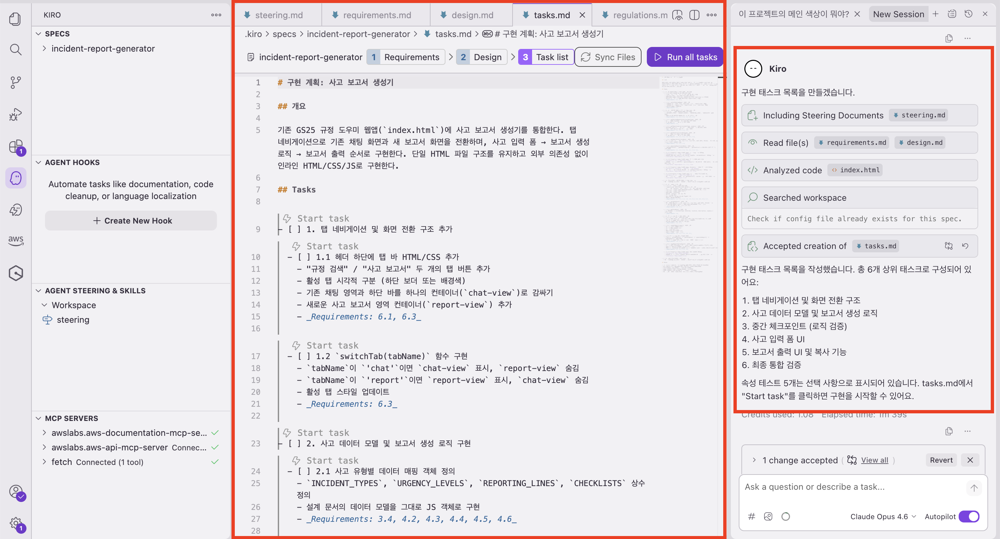

태스크 작성이 완료되고 나면     
가운데 화면에 체크리스트처럼 생긴 목록이 보일 겁니다. 예를 들면:

| 순서 | Task 내용 | 편의점 비유 |
| --- | --- | --- |
| ☐ Task 1 | 프로젝트 기본 구조 만들기 | 가게 뼈대 세우기 🏠 |
| ☐ Task 2 | 입력 폼 화면 만들기 | 카운터 설치하기 |
| ☐ Task 3 | 보고서 생성 로직 만들기 | 조리 시스템 설치하기 🍳 |
| ☐ Task 4 | 결과 화면 만들기 | 메뉴판 걸기 |
| ☐ Task 5 | 디자인 다듬기 | 인테리어 마무리 ✨ |

> **ℹ️ 참고**     
> Task 개수는 앱의 복잡도에 따라 다릅니다.     
> 보통 이 정도의 과제에서는 3~7개 정도의 메인 Task가 만들어져요.

***

## ▶️ Step 2: Task 실행하기

이제 Task를 하나씩 실행합니다!

1. 첫 번째 Task 위의 `Start task`를 클릭합니다 ⚡️

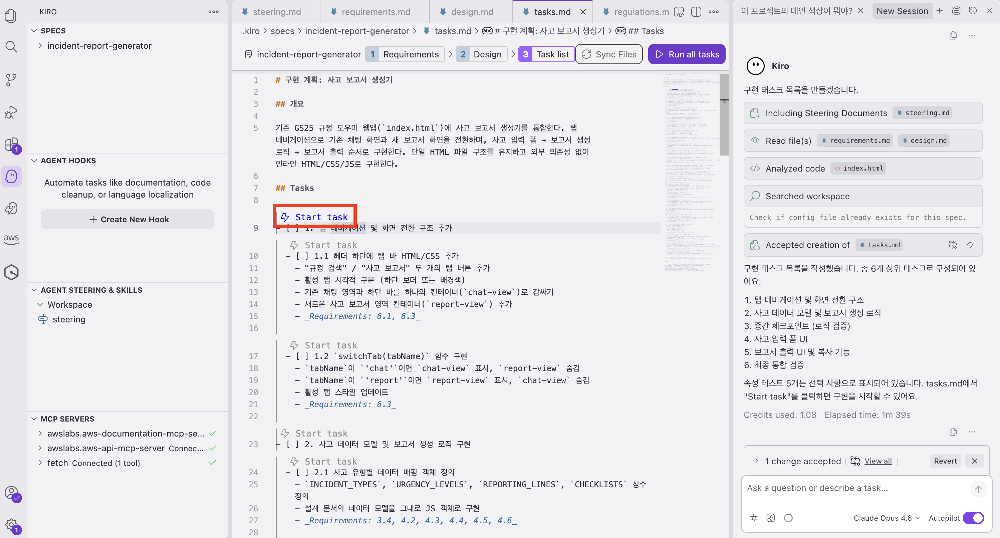

2. Kiro가 해당 Task의 코드를 자동으로 만들기 시작합니다 🧑‍💻 (Task in progress)

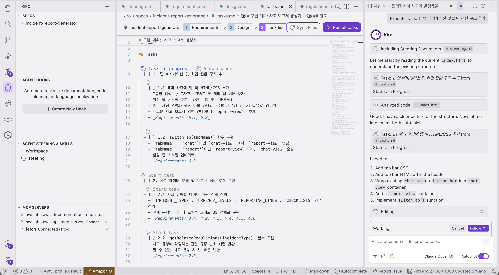

3. Task 하나가 완료되면 ✅ 표시가 됩니다
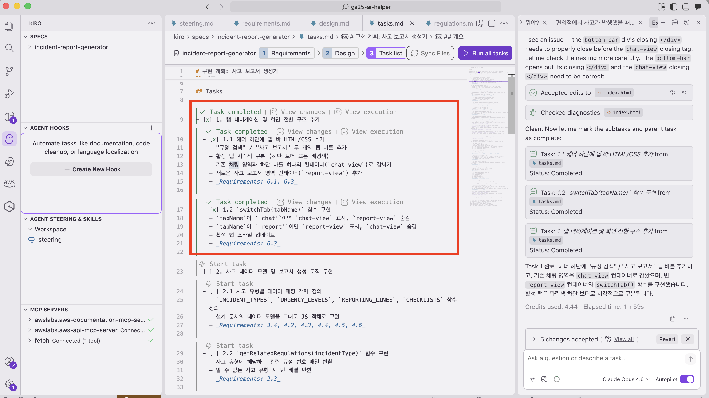

4. 다음 Task의 체크박스를 클릭하여 계속 진행합니다
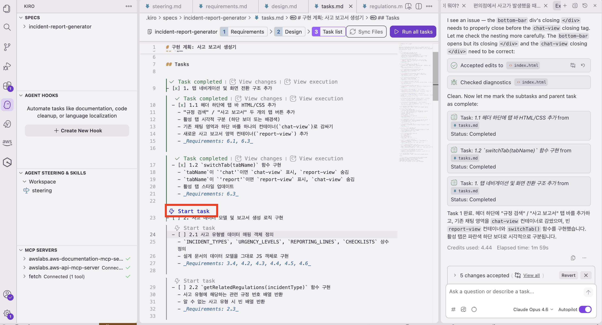

> **⚠️ 잠깐! 중요해요!**
> - Task는 **순서대로** 실행해야 합니다! (1번 끝나야 2번 시작)
> - 하나의 Task가 끝날 때까지 **기다려주세요** ⏳
> - Task 하나당 **1~3분** 정도 걸릴 수 있습니다
> - 전체 Task 완료까지 **5~10분** 정도 예상해주세요

> 하나씩 실행하기 번거로우시죠? 🤔   
> `Run all tasks` 버튼을 클릭해 전부 실행시키는 방법도 있습니다!   
> 다만 중간 중간 태스크가 실행되는 과정을 검토하고 지켜보기 위해, 순서대로 하나씩 실행해보시는 것을 권장드립니다!

> ⭐️ 중간중간 아래 캡처 화면처럼 Kiro가 여러분의 입력을 기다릴 때도 있습니다!
> 컴퓨터 내부 환경을 건드리는 민감한 작업 등에 대해서는 여러분의 컨펌이 필요하기 때문인데요,
> 이럴 때는 `Run` 버튼을 눌러서 Kiro 가 작업을 계속할 수 있게 해주세요!
> 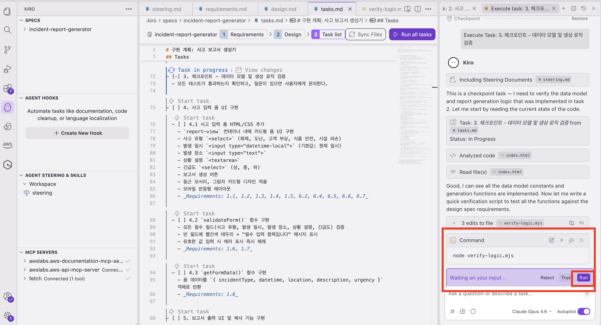

***

## ⏳ 기다리는 동안...

Task가 실행되는 동안 코드가 자동으로 생성되는 모습을 구경해보세요! 👀

화면 가운데 코드 영역에서 글자가 빠르게 쓰여지는 것이 보입니다.     
이게 바로 **AI가 코드를 작성하는 모습**이에요.

> **ℹ️ 참고**    
> 바이브 코딩(Module 2)에서는 **한 번에 전체를 만들었다면**,    
> Task 실행은 **단계별로 나눠서 차근차근** 만듭니다.     
>     
> 🏗️ 비유하면:     
> 바이브 코딩 = "가게 한 번에 뚝딱 지어줘!"     
> Task 실행 = "기초공사 → 골조 → 배관 → 내장 → 인테리어" 순서대로 공사

***

## 👀 Step 3: 완성된 앱 확인하기

모든 Task에 ✅ 표시가 되면 앱이 완성된 겁니다! 🎉

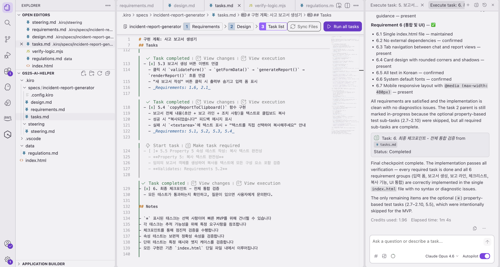

Module 2에서 했던 것처럼 결과를 확인해봅시다:

1. Finder 또는 파일 탐색기에서 `index.html` 파일을 찾습니다
2. `index.html` 파일이 보이신다면 **더블클릭** 해주세요!   
잠시 후 **브라우저(인터넷 창)가 자동으로 열리면서** 앱이 나타납니다! 🚀
3. 브라우저에서 앱을 확인합니다!

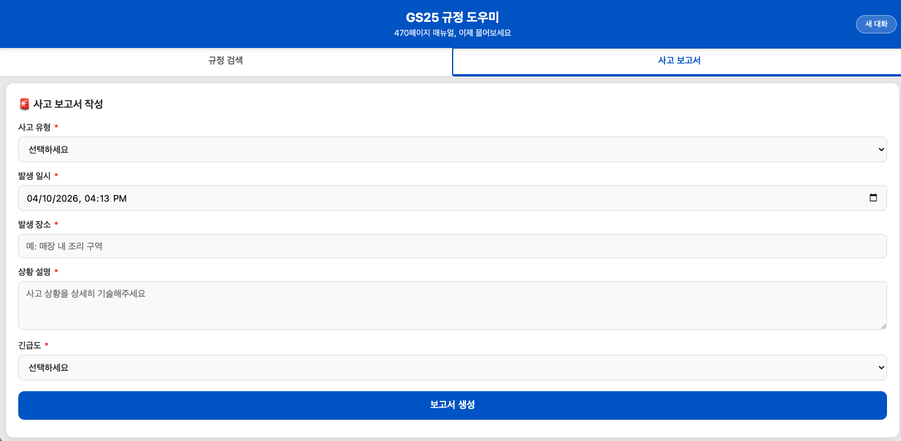
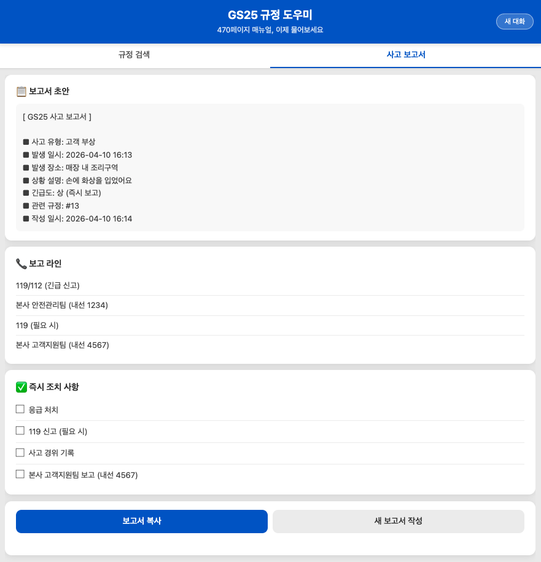
***

## ⚖️ 바이브 코딩 vs Spec+Task, 뭐가 다를까?

같은 "사고 대응 보고서 생성기"를 두 가지 방법으로 만들었다고 생각해보세요:

| | 🗣️ 바이브 코딩 | 📐 Spec + Task |
| --- | --- | --- |
| **만드는 과정** | 채팅으로 이것저것 요청 | 설계 → 자동 생성 |
| **소요 시간** | 빠름 (5~10분) | 좀 더 걸림 (15~20분) |
| **결과물 품질** | 간단한 앱에 적합 | 복잡한 앱도 체계적 |
| **수정 용이성** | 채팅으로 즉시 수정 | 설계부터 수정 가능 |
| **편의점 비유** | 말로 인테리어 지시 | 도면 그려서 시공 |
| **추천 상황** | 아이디어 빠르게 테스트 | 제대로 만들 때 |

> **💡 꿀팁!**   
> 실무에서는 두 가지를 **섞어 쓰는 것**이 가장 좋습니다!    
>    
> 1. **Spec**으로 큰 틀을 잡고 → Task로 기본 앱 생성   
> 2. 이후 **바이브 코딩**으로 세부 사항 조정      
>     
> 마치 설계도면으로 집을 짓고 → 가구 배치는 직접 조정하는 것과 같아요! 🏠

***

## 🔧 잘 안 되는 경우

😰 Task 실행 중에 에러가 났어요

걱정 마세요! 흔히 있는 일입니다.

1. Kiro Chat에서 **"에러가 났어, 고쳐줘"** 라고 입력해보세요
2. Kiro가 자동으로 에러를 분석하고 수정해줍니다
3. 수정 후 다시 해당 Task 체크박스를 클릭하면 됩니다

그래도 안 되면 진행자에게 문의해주세요! 🙋

😴 Task가 너무 오래 걸려요 (5분 이상)

가끔 네트워크 상황에 따라 오래 걸릴 수 있습니다.

- **계속 진행 중이라면** (코드가 계속 생성되고 있다면): 조금만 더 기다려주세요
- **완전히 멈춘 것 같다면**: Kiro Chat에서 "계속 진행해줘"를 입력해보세요
- **그래도 안 되면**: 진행자에게 문의해주세요

🤷 Task 목록이 안 보여요

Design 문서 생성이 완료되었는지 확인해주세요.

1. Specs 패널에서 Design 문서가 있는지 확인
2. Design 문서 아래에 Tasks 섹션이 있어야 합니다
3. 안 보인다면 Kiro Chat에서 "Tasks를 만들어줘"라고 요청해보세요

***

> **✅ 보너스 실습 완료!**       
> Spec의 전체 과정 (아이디어 → Requirements → Design → **Tasks → 완성된 앱**)을 모두 체험하셨습니다! 👏    
>     
> 이 과정이 익숙해지면, **복잡한 앱도 체계적으로** 만들 수 있게 됩니다.     
> 오늘은 맛보기였지만, 나중에 꼭 다시 시도해보세요! 💪
