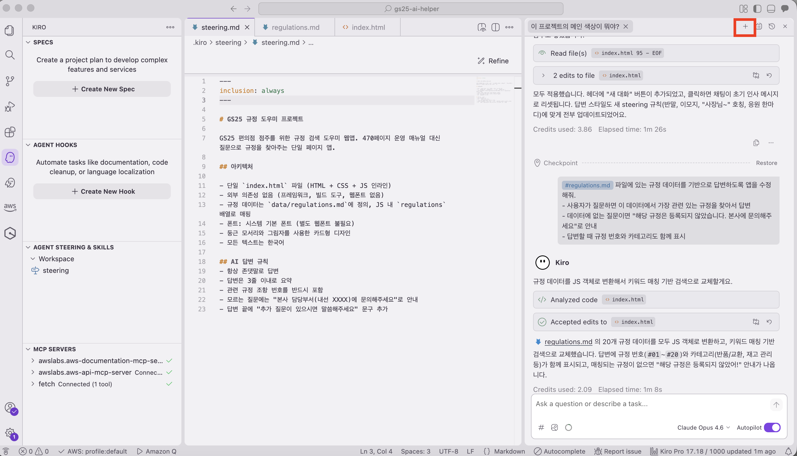
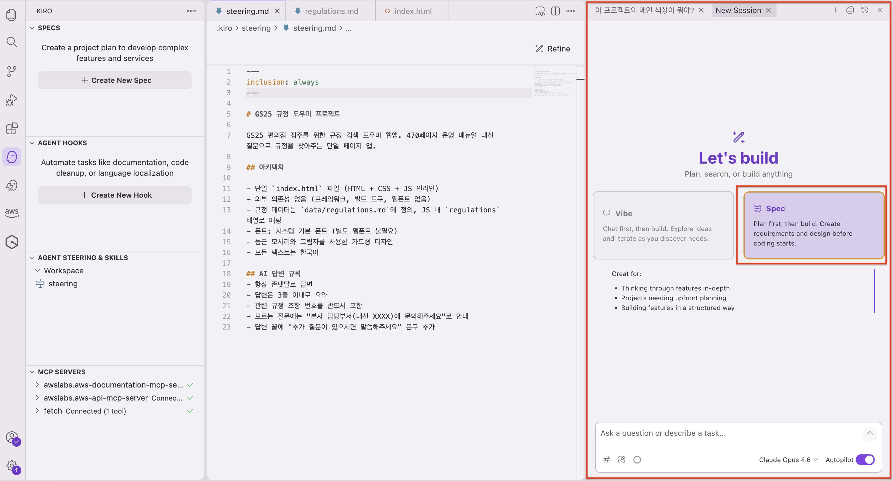
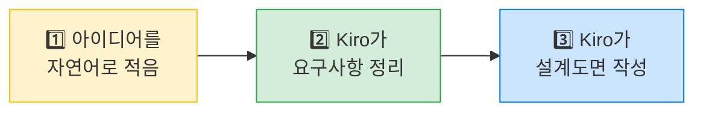

# Spec 작성해보기 ✍️

자, 이제 직접 Spec을 작성해봅시다! 걱정 마세요 — 여러분은 **하고 싶은 말을 적기만** 하면 됩니다 😊

***

## 🔍 Step 1: Spec 모드 활용하기

Kiro의 Spec 모드 채팅 창을 열겠습니다.

1. 이전까지 작업했던 채팅 창의 우측 상단 `+` 버튼을 클릭하면 새로운 대화 창을 열 수 있습니다.



2. 새 대화 창이 열리면 아래와 같이 `Spec` 모드를 선택합니다!



***

## ✏️ Step 2: 요구사항 작성하기

앞서 Vibe 모드로 작업했을 때와 우리의 작업 방식은 비슷합니다!    
**달라지는 건 AI의 작업 방식이에요!** 🤖 

채팅창에 "나는 이런 앱이 필요해요"라는 내용을 적어봅니다.

아래 내용을 **복사해서 그대로 붙여넣기** 하세요! (Ctrl+C → Ctrl+V, 맥은 Cmd+C → Cmd+V)

**📋 Spec 프롬프트에 입력**

```
편의점에서 사고가 발생했을 때 대응 보고서를 자동으로 생성해주는 웹앱을 만들고 싶어.

입력 항목:
- 사고 유형 선택 (화재, 도난, 고객 부상, 식품 안전, 시설 파손)
- 발생 일시
- 발생 장소 (매장 내 위치)
- 상황 설명 (자유 텍스트)
- 긴급도 (상/중/하)

출력:
- 사고 보고서 초안 (공식 양식)
- 긴급도에 따른 보고 라인 안내
- 즉시 조치 사항 체크리스트
- 보고서 복사 버튼
```

붙여넣기가 되었으면, **Enter 키**를 누르세요! ⏎


> **⚠️ 잠깐!**
> Enter를 눌러도 아무 반응이 없나요? 🤔\
> 입력창 안에서 줄바꿈이 되고 있을 수 있습니다.\
> 입력창 옆에 **전송 버튼**(화살표 모양 ➤)이 있다면 그것을 클릭해보세요!

***

## 👀 Step 3: Requirements 확인하기 — 마법이 시작됩니다! ✨

Enter를 누르고 잠시 기다리면... Kiro가 열심히 일하기 시작합니다! ⏳


**30초~1분 정도** 기다리면, Kiro가 **Requirements(요구사항) 문서**를 자동으로 만들어줍니다.

### 😲 이런 것들이 자동으로 정리됩니다!

여러분이 짧게 적은 내용을, AI가 이렇게 **체계적으로 펼쳐줍니다**:

| 여러분이 적은 것 | Kiro가 정리해준 것 |
| --- | --- |
| "사고 유형 선택" 한 줄 | ✅ 어떤 종류의 사고가 있는지 목록화 |
| | ✅ 각 사고 유형별로 어떤 정보가 필요한지 정리 |
| "보고서 초안" 한 줄 | ✅ 보고서에 들어갈 항목 구체화 |
| | ✅ 보고서 양식과 포맷 설계 |
| (적지도 않은) | ✅ 예외 상황 처리 (입력을 빼먹으면?) |
| | ✅ 화면 구성 (어떤 페이지가 필요한지) |


> **ℹ️ 놀랍지 않나요?**
> 여러분이 한 것: **아이디어를 자연어로 적음** (2분) ⏱️\
> Kiro가 한 것: **그것을 전문가 수준의 요구사항 문서로 정리** (1분) 🤖\
> \
> 마치 편의점 리모델링할 때 "카운터는 입구 쪽에, 냉장고는 안쪽에"라고만 말했는데,\
> 전문 설계사가 **전기 배선, 동선, 법규 검토**까지 알아서 해준 느낌입니다! 🏗️

Requirements 문서를 **스크롤하면서 읽어보세요**. "아, 내가 이런 것까지 생각 못 했는데 Kiro가 알아서 넣어줬네!" 하는 부분이 분명 있을 겁니다 😄

***

## 📐 Step 4: Design 문서 생성하기 — 설계도면 완성!

Requirements가 만족스러우면, **Design** 단계로 넘어갑니다.


Kiro가 Requirements를 바탕으로 **설계 문서(Design)**를 자동 생성합니다:

| 설계 항목 | 쉽게 말하면 |
| --- | --- |
| 🖥️ 화면 레이아웃 구성 | 어떤 화면이 어디에 배치되는지 (진열대 배치도) |
| 🔗 화면 간 연결 구조 | 어떤 버튼을 누르면 어디로 가는지 (매장 동선) |
| 📊 데이터 흐름 | 입력한 정보가 어떻게 처리되는지 (주문→조리→제공 과정) |


> **⚠️ 잠깐!**
> Design 문서에 영어가 많이 보여도 당황하지 마세요! 🇺🇸\
> 이건 개발자를 위한 설계도이기 때문에 영어가 섞이는 것이 정상입니다.\
> 중요한 건 **"내가 원하는 기능이 빠짐없이 들어갔는가"**만 확인하면 됩니다! ✅

***

## 🎉 여기까지가 오늘의 Spec 체험입니다!

정리하면 여러분은 방금 이런 일을 했습니다:



> **✅ 대단해요!**
> 여러분은 방금 **전문 기획자가 며칠 걸려 하는 일**을 10분 만에 체험했습니다! 🎊\
> \
> 실제 프로젝트에서는 이 설계도를 바탕으로 **코드를 자동 생성하는 단계**까지 진행할 수 있습니다.\
> (오늘은 시간 관계상 여기까지!)

***

## ⚖️ 바이브 코딩과 비교

| | 🗣️ 바이브 코딩 (Module 2) | 📐 Spec (Module 3) |
| --- | --- | --- |
| **과정** | 채팅으로 바로 코드 생성 | 요구사항 → 설계 → (코드 생성) |
| **느낌** | "일단 만들어봐!" 🏃 | "계획부터 세우자" 📋 |
| **편의점 비유** | 말로 인테리어 지시 | 설계도면 먼저 |
| **언제 좋을까** | 빠르게 프로토타입 만들 때 | 제대로 된 앱을 만들 때 |

두 방식을 **섞어 쓸 수도 있습니다!** 💡\
예: Spec으로 큰 틀을 잡고 → 세부 조정은 바이브 코딩으로.

***

## 🚀 더 해보고 싶다면? — Task 실행 (보너스)

> **💡 시간이 남거나 호기심이 있으신 분!**
> 지금까지 만든 Requirements + Design을 바탕으로 **실제로 코드를 자동 생성**하는 것까지 해볼 수 있습니다.\
> 다만 Task 실행은 5~10분 정도 걸릴 수 있어서, 워크샵 중에는 선택 사항입니다.\
> \
> 👉 [🚀 (보너스) Task 실행하기](run-tasks.md)로 이동!

자, 이제 배운 것을 모두 활용해서 **자유 실습**에 도전해볼까요? 🔥 다음 Module로 넘어가세요! ➡️
