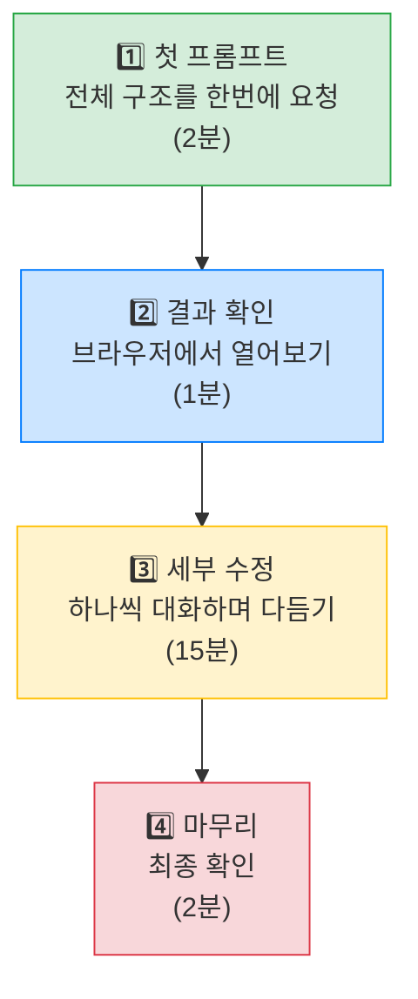

# Module 4: 자유 실습 - 나만의 점포 도우미 만들기 🛠️

## 🔥 드디어 본 게임입니다!

Module 1~3에서 배운 모든 것을 총동원해서, **우리 매장에 진짜 필요한 앱**을 직접 만들어봅시다!

| 순서 | 내용 | 시간 |
| --- | --- | --- |
| 1 | 📋 주제 선택 | 5분 |
| 2 | 💻 자유 바이브 코딩 | 20분 |
| 3 | 🎤 결과 공유 | 5분 |

> **ℹ️ 이것만 기억하세요!**
> 완벽한 앱을 만드는 게 아닙니다.\
> **"이런 게 있으면 우리 매장에서 진짜 쓰겠다!"** 하는 아이디어를 **눈에 보이게 만드는 것**이 핵심입니다! 💡

***

## 📋 실습 규칙

### 기본 규칙 ✅

* 5개 주제 중 **내가 관심 있는 것 하나**를 선택합니다
* Module 1~3에서 배운 것을 총동원합니다:
  * 🧭 **Steering**으로 프로젝트 규칙 설정
  * 💬 **바이브 코딩**으로 앱 구현
  * 📎 **@파일**로 데이터 연결 (필요시)
* **⏱️ 20분** 안에 브라우저에서 동작하는 앱을 완성합니다

### ⏱️ 타이머 안내

진행자가 화면에 타이머를 띄워놓겠습니다!

| 시간 | 안내 |
| --- | --- |
| **20:00** | 🟢 시작! "큰 그림부터 그리세요" |
| **15:00** | 🟡 "기본 화면이 나왔으면 세부 기능으로!" |
| **10:00** | 🟠 "반환점! 새 기능보다 있는 것 다듬기에 집중!" |
| **05:00** | 🔴 "마무리 단계! 완성도를 높이세요" |
| **00:00** | 🏁 종료! ✋ |

***

## 🚀 진행 꿀팁

### 1️⃣ Steering 먼저! (처음 2분)

새 프로젝트를 시작할 때 **Steering부터** 작성하세요!

Module 1에서 작성한 것을 복사한 뒤, 주제에 맞게 수정하면 빠릅니다.

### 2️⃣ 크게 시작, 작게 다듬기!



**📋 좋은 순서 예시**

```
[좋은 예] ✅
"사고 유형을 선택하면 보고서 초안이 자동 생성되는 웹페이지 만들어줘" (큰 그림)
→ "사고 유형 선택을 드롭다운으로 바꿔줘" (세부 수정)

[안 좋은 예] ❌
"드롭다운 메뉴 하나 만들어줘" (부분부터 시작)
→ 전체 구조 없이 부분만 만들면 나중에 합치기 어려움
```

### 3️⃣ 막히면? 당황하지 마세요! 😊

* 📖 프롬프트 주문서(Module 2)를 다시 참고하세요
* 🤖 "이런 기능 추가할 수 있어?" 라고 AI에게 물어보세요 — AI가 방법을 알려줍니다!
* 🙋 진행자에게 손을 들어주세요 — 부끄러워하지 마세요, 다들 처음입니다!

***

## 🎤 결과 공유 — 자랑하는 시간!

다 만들고 나면, 만든 앱을 서로 구경하는 시간을 가집니다 👀

공유할 때 이 순서로 말하면 깔끔합니다:

1. **"저는 ___ 을/를 만들었습니다"** (5초)
2. **브라우저에서 앱 데모** — 실제로 클릭하면서 보여주기 (15초)
3. **"이 기능이 있으면 ___ 할 때 편합니다"** (5초)

> **ℹ️ 꿀팁**
> 발표 전에 **브라우저 탭을 미리 열어놓으세요!** 🌐\
> 발표할 때 당황하며 URL을 찾는 시간을 아낄 수 있습니다.

> **💡 옆 사람 것도 구경해보세요!**
> 같은 주제를 골랐는데 전혀 다른 앱이 나올 수도 있고,\
> 다른 주제인데 "아 저것도 좋은데!" 하는 영감을 받을 수도 있습니다 😊

자, 주제를 선택하러 가볼까요? 다음 페이지에서 5개 주제를 확인하세요! ➡️
