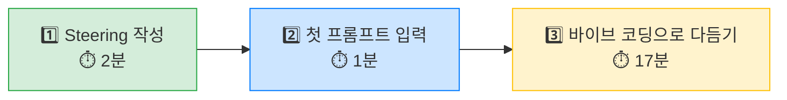

# 주제 선택 가이드 🎯

아래 5가지 주제 중 하나를 선택하세요!\
각 주제마다 **첫 프롬프트 예시**, **Steering 힌트**, 그리고 **보너스 아이디어**를 준비했습니다.

> **ℹ️ 어떤 주제를 골라야 할지 모르겠다면?**
> "우리 매장에서 가장 귀찮은 일"을 떠올려보세요. 그게 정답입니다! 😉

***

## 주제 1: 📚 규정 & 전결 네비게이터

> 470페이지 매뉴얼 탐색을 한 문장 검색으로!

### 😩 현재 상황 (공감되시죠?)

"이 상품 반품 처리는 누구한테 결재받아야 하지...?" 🤔

470페이지짜리 운영 매뉴얼을 펼칩니다. 목차를 찾아보고... 페이지를 넘기고... "아 이게 아닌데..." 다시 처음부터... 😵‍💫

바쁜 매장에서 매뉴얼 펼쳐놓고 찾을 시간이 어디 있나요! 그러다 보면 "그냥 선배한테 물어봐야겠다"하고 전화하게 되고, 선배도 바쁜데 같은 질문을 또 받게 되고...

**이 앱이 있으면**: 궁금한 것을 그냥 **채팅처럼 물어보면** 관련 규정과 담당자를 바로 알려줍니다! 💬

| 항목 | 내용 |
| --- | --- |
| **핵심 기능** | 질문 입력 → 관련 규정 검색 → 답변 표시 |
| **입력** | 자연어 질문 (예: "반품 전결권자가 누구야?") |
| **출력** | 규정 조항 + 담당자 안내 + 응대 스크립트 |

**📋 첫 프롬프트 예시**

```
편의점 점주가 운영 규정을 검색할 수 있는 채팅형 웹페이지를 만들어줘.

- 상단: "GS25 규정 도우미" 타이틀
- 중앙: 채팅 영역 (질문/답변)
- 하단: 입력창 + 전송 버튼
- 자주 묻는 질문 예시 버튼 3개
- @data/regulations.md 파일의 규정 데이터를 기반으로 답변
```

> **ℹ️ 프롬프트 설명**
> - `채팅형 웹페이지`: 카카오톡처럼 말풍선이 오가는 형태를 만들라는 뜻이에요
> - `자주 묻는 질문 예시 버튼`: 매번 타이핑 안 해도 버튼 하나로 질문할 수 있게!
> - `@data/regulations.md`: Module 2에서 배운 @파일 연결! 규정 데이터를 AI에게 알려줍니다

**📋 Steering 힌트**

```markdown
## AI 답변 규칙
- 규정 조항 번호를 반드시 포함
- 담당 부서/전결권자 정보 함께 안내
- 모르는 내용은 "본사 고객센터(1577-XXXX)에 문의해주세요"로 안내
- 답변은 3줄 이내로 간결하게
```

> **ℹ️ Steering 설명**
> - `규정 조항 번호를 반드시 포함`: AI가 "이 규정이요~"만 말하고 끝내지 않도록! 근거를 함께 알려주게 합니다
> - `모르는 내용은 본사 문의 안내`: AI가 모르는 걸 지어내는 것(할루시네이션)을 방지!

### 💡 이런 것도 추가해보세요!

시간이 남으면 이런 기능도 도전해보세요:

- 🔖 **즐겨찾기 기능**: 자주 찾는 규정을 북마크
- 📋 **최근 검색 내역**: 아까 찾았던 규정을 다시 빠르게 확인
- 🏷️ **카테고리 필터**: "인사", "재고", "CS" 등 분야별로 분류
- 📱 **모바일 최적화**: 매장에서 스마트폰으로 보기 편하게

***

## 주제 2: 🚨 사고 대응 보고서 생성기

> 긴급 상황에서 보고서 작성 시간을 제로로!

### 😩 현재 상황 (공감되시죠?)

새벽 3시, 매장에서 시설 파손 사고가 발생했습니다. 😰

CCTV 확인하고, 현장 정리하고, 경찰 연락하고... 그러면서 동시에 **보고서도 써야 합니다**. "발생 일시... 발생 장소... 상황 경위..." 양식에 맞춰서 쓰려니 머리가 하얘집니다.

긴급한 상황인데 보고서 양식 찾느라 시간 쓰고, 문장 다듬느라 시간 쓰고... 정작 현장 대응에 써야 할 시간을 보고서에 빼앗기고 있습니다. 😫

**이 앱이 있으면**: 사고 정보만 빠르게 선택하면 **공식 양식의 보고서가 자동 생성**됩니다! 📝

| 항목 | 내용 |
| --- | --- |
| **핵심 기능** | 사고 정보 입력 → 보고서 자동 생성 |
| **입력** | 사고 유형, 일시, 장소, 상황 설명, 긴급도 |
| **출력** | 보고서 초안 + 보고 라인 안내 + 조치 체크리스트 |

**📋 첫 프롬프트 예시**

```
편의점 사고 대응 보고서를 자동 생성하는 웹페이지를 만들어줘.

- 좌측: 입력 폼
  - 사고 유형 드롭다운 (화재, 도난, 고객 부상, 식품 안전, 시설 파손)
  - 발생 일시 (날짜/시간 선택)
  - 발생 장소 (매장 내 위치)
  - 상황 설명 (텍스트 입력)
  - 긴급도 선택 (상/중/하, 색상으로 구분)
- 우측: 생성된 보고서 미리보기
- 하단: "보고서 복사" 버튼
```

> **ℹ️ 프롬프트 설명**
> - `좌측/우측`: 화면을 반으로 나눠서 왼쪽은 입력, 오른쪽은 결과를 보여주는 구조
> - `드롭다운`: 클릭하면 목록이 펼쳐져서 하나를 고르는 메뉴 (카카오톡에서 "+" 누르면 나오는 메뉴 같은 것!)
> - `긴급도 색상 구분`: 상=빨간색, 중=노란색, 하=초록색으로 한눈에 구분

**📋 Steering 힌트**

```markdown
## 보고서 생성 규칙
- 공식 문서 톤 (경어체, 간결)
- 긴급도 '상'인 경우 즉시 보고 문구 강조 (빨간색 배너)
- 조치 사항 체크리스트 반드시 포함
- 보고 라인: 점장 → 지역 담당 → 본부
- 보고서 상단에 생성 일시 자동 표시
```

> **ℹ️ Steering 설명**
> - `공식 문서 톤`: 보고서니까 "~했음", "~확인됨" 같은 딱딱한 말투를 쓰라는 뜻
> - `보고 라인`: 누구에게 먼저 보고해야 하는지 순서를 알려줍니다

### 💡 이런 것도 추가해보세요!

- 📸 **사진 첨부 영역**: CCTV 캡처나 현장 사진 자리 표시
- ⏰ **긴급도별 자동 문구**: "상"이면 "즉시 전화 보고 필수!" 같은 경고 표시
- 📊 **사고 이력 대시보드**: 과거 사고 유형별 통계 차트
- 📱 **카카오톡 공유 형식**: 보고서를 카톡으로 보내기 좋은 텍스트로 변환

***

## 주제 3: 🚬 담배권 망실 리스크 체크

> 점포 주소만 입력하면 리스크 등급을 바로 확인!

### 😩 현재 상황 (공감되시죠?)

새 점포 오픈 준비 중입니다. 담배 판매 면허, 받을 수 있을까? 🤔

"우리 점포에서 가장 가까운 학교가 몇 미터지...?" 네이버 지도 켜고, 학교 위치 찾고, 거리를 대충 재보고... "이거 200미터 안인가 밖인가?" 🧐 애매합니다.

조례가 지역마다 달라서, 잘못 판단하면 면허가 날아갈 수도 있는데... 매번 담당 부서에 전화해서 물어봐야 하는 현실 😓

**이 앱이 있으면**: 주소만 넣으면 **신호등처럼 색상으로** 리스크 등급을 바로 알려줍니다! 🚦

| 항목 | 내용 |
| --- | --- |
| **핵심 기능** | 주소 입력 → 리스크 등급(High/Mid/Low) 판정 |
| **입력** | 점포 주소 |
| **출력** | 리스크 등급 + 판정 근거 + 대응 가이드 |

**📋 첫 프롬프트 예시**

```
편의점 담배 판매 면허 리스크를 체크하는 웹페이지를 만들어줘.

- 상단: "담배권 리스크 체크" 타이틀
- 주소 입력란
- "리스크 확인" 버튼
- 결과 표시 영역:
  - 리스크 등급을 신호등 색상으로 표시 (빨강/노랑/초록)
  - 판정 근거 설명
  - 등급별 대응 가이드
```

> **ℹ️ 프롬프트 설명**
> - `신호등 색상`: 빨강=위험, 노랑=주의, 초록=안전 — 누가 봐도 한눈에 이해!
> - `판정 근거 설명`: "왜 이 등급인지" 이유를 같이 보여줘서 신뢰할 수 있게
> - `등급별 대응 가이드`: 빨강이면 뭘 해야 하는지, 노랑이면 뭘 확인해야 하는지 안내

**📋 Steering 힌트**

```markdown
## 리스크 판정 규칙
- High(빨강): 학교 200m 이내, 조례 위반 가능성 → "면허 취득 불가 가능성 높음"
- Mid(노랑): 경계 지역, 추가 확인 필요 → "관할 구청에 확인 권장"
- Low(초록): 제한 없음 → "면허 취득 가능성 높음"
- 판정 근거를 항상 명시
- 면책 문구: "본 결과는 참고용이며, 최종 판단은 관할 관청에 확인하세요"
```

> **ℹ️ Steering 설명**
> - 리스크를 **3단계로 단순화**해서 누구나 바로 이해할 수 있게 합니다
> - `면책 문구`: 앱의 결과만 믿고 진행했다가 문제가 생기면 안 되니까, "공식 확인은 따로 하세요"를 꼭 넣습니다!

### 💡 이런 것도 추가해보세요!

- 🗺️ **지도 표시**: 점포 위치와 주변 학교/유해시설 거리 시각화
- 📝 **체크리스트**: 면허 신청에 필요한 서류 목록
- 📊 **지역별 기준 비교**: 각 구/시의 조례 차이 안내
- 💾 **결과 저장/인쇄**: 보고용으로 결과를 깔끔하게 출력

***

## 주제 4: 🤝 재계약 어시스턴트

> 데이터 기반 협상 카드로 재계약을 스마트하게!

### 😩 현재 상황 (공감되시죠?)

재계약 시즌이 다가옵니다. 경영주님을 만나야 하는데... 😰

"매출이 이만큼 올랐으니 조건을 이렇게 제안하면 어떨까?" 하는 전략이 필요한데, 숫자를 정리하는 것부터 시간이 걸립니다. 엑셀 열고, 매출 추이 찾고, 비교 데이터 만들고...

그리고 가장 어려운 건 **경영주님을 설득하는 멘트**입니다. "어떻게 말씀드려야 긍정적으로 받아들이실까?" 머리를 쥐어짜봐도 쉽지 않죠 😓

**이 앱이 있으면**: 점포 정보만 넣으면 **협상 전략 + 설득 멘트**가 자동 생성됩니다! 🎯

| 항목 | 내용 |
| --- | --- |
| **핵심 기능** | 점포 정보 입력 → 협상 전략 + 설득 멘트 생성 |
| **입력** | 점포명, 매출 추이, 계약 조건, 경영주 특성 |
| **출력** | 협상 카드 + 경영주 설득 스크립트 + 리더 보고용 요약 |

**📋 첫 프롬프트 예시**

```
편의점 재계약 협상을 도와주는 웹페이지를 만들어줘.

- 입력 폼:
  - 점포명
  - 월 평균 매출 (만원)
  - 계약 기간
  - 주요 이슈 (텍스트)
- 결과 영역:
  - 협상 포인트 카드 3장 (강점/약점/전략)
  - 경영주 설득 스크립트 (복사 가능)
  - 리더 보고용 한줄 요약
```

> **ℹ️ 프롬프트 설명**
> - `협상 포인트 카드 3장`: 카드 형태로 강점/약점/전략을 보기 좋게 정리
> - `경영주 설득 스크립트`: 실제로 말할 대사를 만들어줍니다! 복사해서 메모장에 붙여놓으면 됨
> - `리더 보고용 한줄 요약`: 상사에게 "이 점포 재계약은 이렇습니다"라고 한 줄로 보고할 수 있는 문장

**📋 Steering 힌트**

```markdown
## 협상 전략 규칙
- 데이터 기반 객관적 분석 톤
- 경영주 설득 멘트는 공감 + 근거 구조 ("경영주님의 노력 덕분에... → 실제 데이터를 보면...")
- 보고용 요약은 1~2줄로 핵심만
- 강점 카드: 긍정적 요소를 부각 (매출 성장률, 고객 만족도 등)
- 약점 카드: 리스크 요인과 대응 방안 함께 제시
- 전략 카드: 구체적인 협상 시나리오 (Best/Worst case)
```

> **ℹ️ Steering 설명**
> - `공감 + 근거 구조`: "대충 좋습니다"가 아니라, 감정적 공감 뒤에 숫자로 뒷받침하는 구조
> - `Best/Worst case`: 최상의 결과와 최악의 결과를 미리 준비해두는 전략

### 💡 이런 것도 추가해보세요!

- 📈 **매출 추이 그래프**: 숫자를 시각적으로 보여주면 설득력 UP
- 🎭 **경영주 유형별 멘트**: "꼼꼼한 타입", "감성적 타입" 등 맞춤 스크립트
- 📋 **미팅 체크리스트**: 재계약 미팅 전 준비사항 목록
- 📧 **이메일 초안**: 재계약 제안 이메일 자동 생성

***

## 주제 5: 📊 G-ESPA 활동 추천 코치

> 점포 상권에 맞는 맞춤형 활동 전략 추천!

### 😩 현재 상황 (공감되시죠?)

"이번 달 G-ESPA 활동은 뭘 해야 하지...?" 🤔

점포마다 상권이 다릅니다. 학교 앞 매장과 오피스 매장은 고객층이 완전 다르죠. 그런데 매번 활동 계획 세울 때마다 "우리 매장에 맞는 전략이 뭘까?" 고민하느라 시간이 갑니다.

보수적으로 갈까, 공격적으로 갈까? 투자 대비 효과는? 경영주님한테는 뭐라고 설명하지? 🤯 이런 것들을 혼자서 다 판단하기가 쉽지 않습니다.

**이 앱이 있으면**: 상권과 목표만 입력하면 **3가지 실행안을 비교**해서 보여줍니다! 📋

| 항목 | 내용 |
| --- | --- |
| **핵심 기능** | 상권/점포 정보 입력 → 보수적/표준/공격적 실행안 제시 |
| **입력** | 상권 유형, 목표 지표, 현재 실적 |
| **출력** | 3가지 실행안 + 필요 리소스 + 경영주 설득 멘트 |

**📋 첫 프롬프트 예시**

```
편의점 점포 맞춤형 활동 전략을 추천해주는 웹페이지를 만들어줘.

- 입력 폼:
  - 상권 유형 선택 (주택가, 오피스, 학교 앞, 역세권, 복합)
  - 목표 (매출 증대, 객단가 향상, 신규 고객, 재방문율)
  - 현재 월 매출 (만원)
- 결과 영역:
  - 3개의 전략 카드 (보수적 / 표준 / 공격적)
  - 각 전략별 필요 리소스와 기대 효과
  - 경영주 설득용 멘트
```

> **ℹ️ 프롬프트 설명**
> - `상권 유형 선택`: 선택지 중에 하나를 고르면 그에 맞는 전략이 나옵니다
> - `3개의 전략 카드`: 위험을 최소화하는 안, 균형 잡힌 안, 적극적인 안을 한눈에 비교!
> - `경영주 설득용 멘트`: "경영주님, 이번에 이 활동을 하면 이만큼 효과가 있습니다"라고 말할 수 있는 대사

**📋 Steering 힌트**

```markdown
## 전략 추천 규칙
- 보수적: 리스크 최소, 기존 자원 활용 → "지금 있는 것만으로도 이만큼!"
- 표준: 균형 잡힌 투자 대비 효과 → "적정 투자로 안정적 성장"
- 공격적: 적극 투자, 높은 기대 수익 → "과감한 투자, 큰 보상"
- 각 전략에 구체적 숫자(예상 매출 증가율) 포함
- 상권 유형별 성공 사례 언급 (예: "역세권 A점포는 이 전략으로 매출 15% 증가")
```

> **ℹ️ Steering 설명**
> - 3가지 전략을 **무조건 비교 형태**로 보여주게 합니다 — 선택의 폭을 주는 거예요!
> - `구체적 숫자`: "좋아집니다"가 아니라 "15% 증가" 같이 숫자가 있어야 설득력이 있습니다

### 💡 이런 것도 추가해보세요!

- 🗓️ **월별 캘린더**: 활동 계획을 달력 형태로 시각화
- 📊 **투자 대비 효과 그래프**: 각 전략의 비용 vs 기대수익을 차트로
- ✅ **실행 체크리스트**: 전략을 선택한 후 주차별 할 일 목록
- 🏆 **성공 사례 모음**: 비슷한 상권의 점포가 어떤 전략으로 성공했는지

***

## 🚀 주제가 정해졌으면, 시작합시다!



### Step 1: Steering 작성 ✏️ (2분)

위의 Steering 힌트를 참고해서 `.kiro/steering.md` 파일을 수정하세요!

### Step 2: 첫 프롬프트 입력 📝 (1분)

위의 프롬프트 예시를 **복사 → 붙여넣기**한 뒤, 필요하면 수정해서 Kiro Chat에 입력!

### Step 3: 바이브 코딩으로 다듬기 💬 (17분)

AI가 만들어준 결과를 보고, 대화하면서 하나씩 수정해나가세요!

> **⚠️ 잠깐! 시간 관리가 핵심입니다!**
> 첫 5분 안에 기본 화면이 나오지 않으면 프롬프트가 너무 복잡한 겁니다.\
> 그럴 때는 **과감하게 기능을 줄이고** 핵심만 먼저 만드세요! ✂️\
> 기본이 되면 그 위에 기능을 **하나씩 추가**하는 게 훨씬 빠릅니다!

**20분 후 결과물을 발표합니다. 시작하세요! 🚀🔥**
