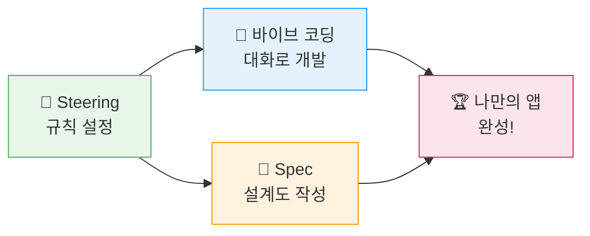
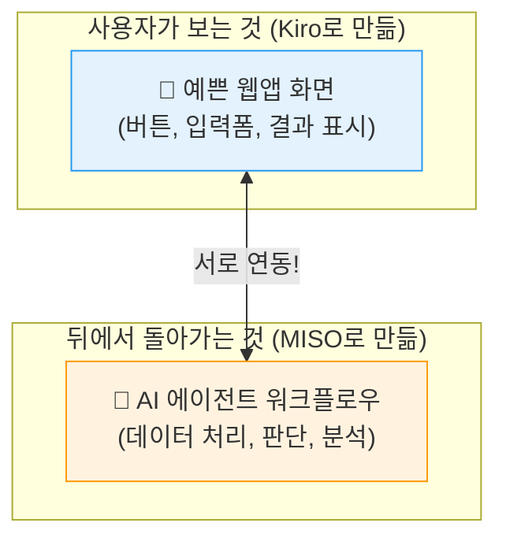

# 🎉 워크샵 정리 — 수고하셨습니다!

## 🏆 오늘 여러분이 해낸 것

잠깐, 오늘 무슨 일이 있었는지 돌아볼까요?

여러분은 오늘 **코드를 한 줄도 직접 작성하지 않고**, 대화만으로 편의점 업무 도우미 앱을 만들었습니다! 👏👏👏

### ✅ 오늘의 성취 목록

하나하나 체크해보세요 — 전부 다 여러분이 해낸 것입니다!

- [x] 🧭 AI에게 규칙을 알려주는 **Steering 파일을 직접 작성**했습니다
- [x] 💬 한글로 대화해서 **웹앱을 만들어냈습니다** (바이브 코딩!)
- [x] 📐 아이디어를 적어서 **AI가 설계도면을 그리게** 했습니다 (Spec!)
- [x] 🤝 팀과 협력해서 **우리 매장에 필요한 도구를 직접 만들었습니다**
- [x] 🎤 만든 앱을 **발표하고 동료들에게 보여줬습니다**

> **✅ 대단합니다!**
> 오늘 아침만 해도 "나는 코딩이랑은 평생 관계없는 사람"이라고 생각하셨죠?\
> 그런데 지금 여러분은 **AI를 활용해서 앱을 만들어본 사람**이 되었습니다! 🌟\
> 이건 정말 대단한 첫 걸음입니다!

***

## 📊 오늘 배운 것 한눈에 보기

| Module | 배운 것 | 핵심 한 줄 | 편의점 비유 |
| --- | --- | --- | --- |
| **Module 1** 🧭 | Steering | AI에게 규칙을 한 번 알려주면 매번 지킨다 | 신입 알바에게 "우리 매장 규칙" 알려주기 📋 |
| **Module 2** 💬 | 바이브 코딩 | 한글로 요청하면 AI가 앱을 만들어준다 | 인테리어 업자에게 말로 지시하기 🗣️ |
| **Module 3** 📐 | Spec | 요구사항을 정리하면 AI가 설계도를 그려준다 | 인테리어 설계도면 먼저 그리기 📐 |
| **Module 4** 🏆 | 팀 챌린지 | 배운 것을 조합해서 나만의 앱을 만든다 | 우리 매장 리모델링 완성! 🎉 |

***

## 🔄 MISO와 Kiro, 뭐가 다른가요?

여러분은 이미 MISO를 사용해보셨죠? 그럼 Kiro와 뭐가 다른지 궁금하실 겁니다!

| | 🧩 MISO | 💻 Kiro |
| --- | --- | --- |
| **만드는 것** | 에이전트 워크플로우 (뒤에서 돌아가는 로직) | 사용자가 직접 쓰는 완성된 앱 (화면 + 로직) |
| **만드는 방법** | 블록을 드래그앤드롭으로 연결 🧱 | 자연어로 대화 💬 |
| **결과물** | API/워크플로우 (눈에 안 보임) | 웹앱, 대시보드 (눈에 보임!) |
| **비유하면** | 편의점 **물류 시스템** 설계 🏭 | 편의점 **매장 인테리어** 🏪 |

### 🤝 둘은 경쟁이 아니라 최고의 파트너!

> **ℹ️ 기억하세요!**
> MISO로 **에이전트의 두뇌** 🧠 (워크플로우)를 만들고,\
> Kiro로 **사용자가 쓰는 앱** 📱 (화면)을 만들면\
> **완성된 AI 서비스**가 됩니다!\
> \
> 둘 다 할 줄 알면 여러분은 **AI 서비스를 처음부터 끝까지 만들 수 있는 사람**입니다! 💪

***

## 💎 Kiro의 핵심 3가지 — 다른 AI 도구와 뭐가 다를까?

### 1. 🧭 Steering — 한 번 알려주면 끝!

> 다른 AI 도구: 매번 "존댓말로, 파란색으로, 한국어로..." 반복해야 함 😫\
> **Kiro**: 한 번 적으면 끝. 프로젝트 전체에 자동 적용! ✨

### 2. 📐 Spec — 체계적 설계!

> 다른 AI 도구: 복잡한 앱일수록 앞뒤가 안 맞음 😵\
> **Kiro**: 요구사항 → 설계 → 구현, 체계적 프로세스! 📋

### 3. 📁 프로젝트 컨텍스트 — 전체를 기억!

> 다른 AI 도구: 대화가 길어지면 앞에 한 말을 잊음 🤷\
> **Kiro**: 프로젝트 전체 파일을 항상 인식하고, @파일로 데이터 연결 가능! 🔗

***

## 🏅 팀 챌린지 결과 발표

각 조의 결과물을 함께 살펴보겠습니다! 🎤

**발표 순서:**
1. 어떤 주제를 선택했는지 🎯
2. 앱 데모 (브라우저에서 보여주기) 💻
3. Steering에 어떤 규칙을 넣었는지 🧭

**🗳️ 투표 시간!**\
발표가 끝나면 **"가장 실무에서 쓰고 싶은 앱"**에 투표해주세요!

***

## 📅 월요일부터 해볼 수 있는 것

오늘 배운 것, 이대로 끝내기 아깝죠? 지금 바로 시작할 수 있는 것들이 있습니다! 🚀

### 🟢 바로 할 수 있는 것 (이번 주)

| 할 일 | 방법 | 예상 시간 |
| --- | --- | --- |
| 오늘 만든 앱 **더 발전시키기** | Kiro 열고 "이 기능 추가해줘"라고 대화 | 30분 |
| 동료에게 **오늘 경험 공유하기** | "나 AI로 앱 만들어봤어!" 자랑하기 😎 | 5분 |
| 매장에서 **불편한 점 목록** 만들기 | 메모장에 "이런 앱 있으면 좋겠다" 적기 | 10분 |

### 🟡 조금 도전해볼 것 (이번 달)

| 할 일 | 방법 | 예상 시간 |
| --- | --- | --- |
| **실제 데이터** 넣어서 실무용으로 만들기 | 매뉴얼/규정 파일을 @파일로 연결 | 1시간 |
| 다른 주제로 **새 앱 만들어보기** | 오늘 못 해본 주제 도전! | 1시간 |
| 팀원들과 **아이디어 모아서** 더 큰 앱 도전 | Spec으로 요구사항 정리부터 시작 | 2시간 |

### 🔴 더 배우고 싶다면 (다음 달)

| 할 일 | 방법 |
| --- | --- |
| **Spec 심화** | Spec → Design → Task 전체 과정으로 더 큰 앱 만들어보기 |
| **MISO + Kiro 연동** | MISO에서 만든 에이전트를 Kiro 앱의 백엔드로 연결하기 |
| **사내 공유** | 우리 팀에서 만든 도구를 다른 팀에도 전파하기 |

***

## 📝 피드백

오늘 워크샵은 어떠셨나요?\
진행자가 공유하는 설문 링크에서 피드백을 남겨주세요! 📱

여러분의 솔직한 의견이 다음 워크샵을 **더 좋게** 만듭니다! 🙏

***

> **🌟 마지막으로 한마디!**
> \
> 오늘 여러분은 **"코딩을 몰라도 AI로 앱을 만들 수 있다"**는 것을 직접 경험했습니다.\
> \
> 이건 시작일 뿐입니다.\
> \
> AI는 계속 발전하고 있고, 여러분이 가진 **현장 경험과 업무 지식**은\
> AI가 절대 대체할 수 없는 가장 중요한 자산입니다.\
> \
> **여러분의 경험 + AI의 기술 = 무한한 가능성** ♾️\
> \
> 오늘의 경험이 여러분의 업무를 더 효율적이고 즐겁게 만드는 데\
> 작은 시작이 되길 진심으로 바랍니다! 💪🔥\
> \
> **수고하셨습니다!** 👏👏👏
